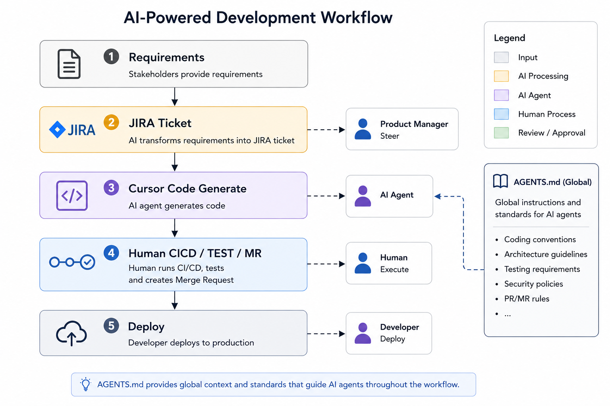

# 案例：生物科技 SWE — JIRA 到 Cursor 流水线

[English](case.md) | **中文**

**类型：** 语音访谈 / 田野笔记  
**来源：** 与受访者语音聊天  
**提炼：** [notes/real-workflows_cn.md](../../notes/real-workflows_cn.md)  
**相关案例：** [003-fintech-doc-pipeline](../003-fintech-doc-pipeline/case_zh.md) · [004-bigtech-infra](../004-bigtech-infra/case_zh.md)

---

## 背景

**生物科技 SWE 团队（约 30 人）：** 一个 scrum 团队，多仓库。Cursor Enterprise（约 $120/人）——**不够用**；工程师还用个人订阅补完工作。

## 工作流

```text
需求 → JIRA 工单           （AI 转换，PM 掌舵）
JIRA → Cursor 生成代码
     → 人跑 CI/CD / 测试 / MR
```

- **全局 `AGENTS.md`** 约束 AI
- **机密**基因相关数据限制能喂给模型的内容
- 团队对 AI **仍在适应期**



### 值得记的一句

两名同事仍手动解 Git 冲突——他们没想到 agent 能做。**采纳往往是认知问题**，不只是工具问题。

## 对 codex-labs 的映射

| 观察             | 在 lab 里的位置                                          |
| ---------------- | -------------------------------------------------------- |
| 每步 PM/开发掌舵 | `workflows/` 人工关卡                                    |
| 全局 AGENTS.md   | [AGENTS_zh.md](../../AGENTS_zh.md) 模式                   |
| 认知缺口         | [notes/real-workflows_cn.md](../../notes/real-workflows_cn.md) |