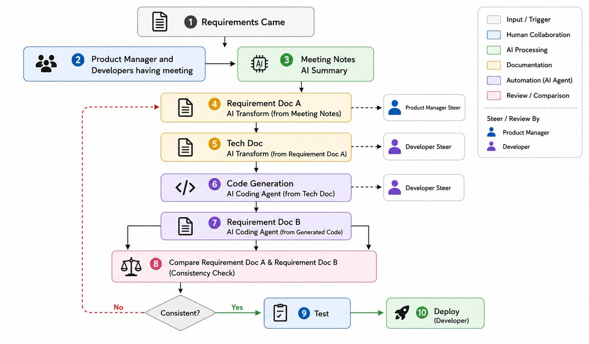

# 案例：金融科技后端 — 文档驱动交付流水线

[English](case.md) | **中文**

**类型：** 语音访谈 / 田野笔记  
**来源：** 与受访者语音聊天  
**提炼：** [notes/research/real-workflows_zh.md](../../notes/research/real-workflows_zh.md)  
**相关案例：** [002-biotech-swe](../002-biotech-swe/case_zh.md) · [004-bigtech-infra](../004-bigtech-infra/case_zh.md)

---

## 背景

**金融科技后端（新加坡 5 人，团队多在中国）：** 一人多仓库。**Codex 与钉钉文档集成。**

## 工作流

```text
需求
  → PM + 开发开会
  → 会议纪要（AI 摘要）
  → 需求文档 A        （AI 转换，PM 掌舵）
  → 技术文档          （AI 转换，开发掌舵）
  → 代码生成          （编码 agent，开发掌舵）
  → 需求文档 B        （从代码反推）
  → 对比 A 与 B       （开发 + PM 掌舵）
```

- **前端**（Android / iOS / Web）消费后端 **AI 生成的接口文档**
- **金融合规**约束整条链
- 编码 agent **提高生产力**，但**总工作量没明显变少**



## 对 codex-labs 的映射

| 观察                | 在 lab 里的位置                           |
| ------------------- | ----------------------------------------- |
| 每步 PM/开发掌舵    | `workflows/` 人工关卡                     |
| 文档 A vs B 对比    | 未来 `workflows/doc-driven-delivery/`     |
| 领域 harness + 评测 | `skills/` + `experiments/`              |