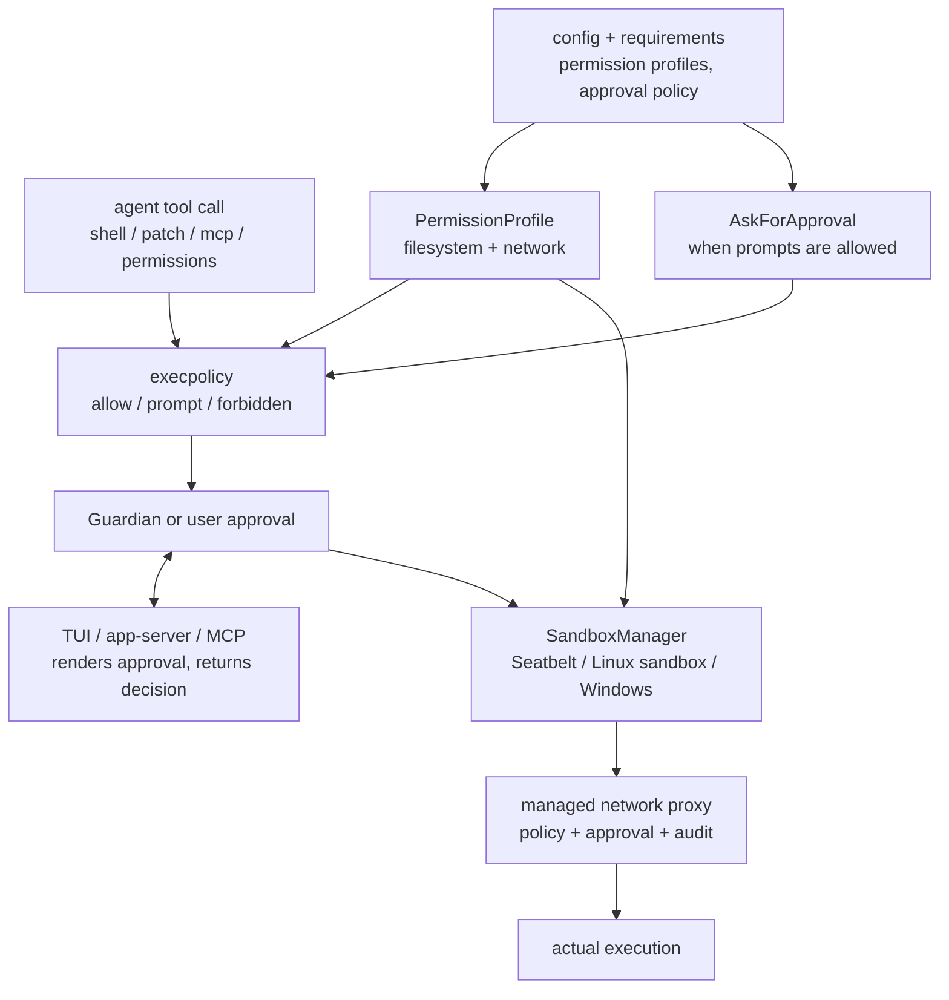
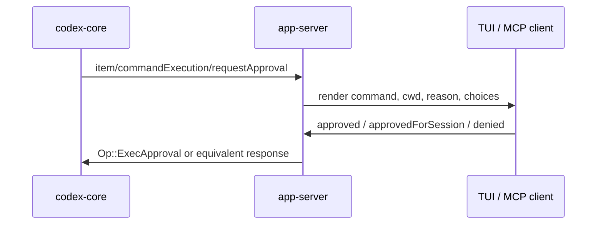

# Codex security design - sandbox, approvals, permissions

**English** | [中文](security-design_zh.md)

> **Answers:** How Codex turns agent actions into bounded runtime decisions: permission profiles define capability, approval policy defines when to ask, execpolicy classifies commands, platform sandboxes enforce filesystem/network limits, and clients render approval requests.
> **Read first:** [architecture.md](architecture.md) · [layered-design.md](layered-design.md).
> **Verified against:** [openai/codex](https://github.com/openai/codex)@`da4c8ca` (2026-07-03) — re-check `git diff da4c8ca..HEAD -- codex-rs/` before trusting details.

> **Official product guide:** [Agent approvals & security](https://developers.openai.com/codex/agent-approvals-security)  
> **In-repo approvals RPC:** [app-server README § Approvals](https://github.com/openai/codex/blob/main/codex-rs/app-server/README.md)  
> **Execpolicy:** [execpolicy README](https://github.com/openai/codex/blob/main/codex-rs/execpolicy/README.md) · [Exec policy (official)](https://developers.openai.com/codex/exec-policy)

---

## One line

Codex security is not a model promise and not a single sandbox switch. It is a runtime pipeline: **permission profile** bounds what may be accessed, **approval policy** decides whether a human or reviewer must consent, **execpolicy** classifies command risk, **platform sandboxing** enforces filesystem/network limits, and **network proxy / Guardian / clients** add review, audit, and UI mediation.

`full-access`, user `!` shell, `process/spawn`, and `External` profiles are explicit trust-boundary exits. Treat them as intentional escape hatches, not normal agent execution.

---

## Mental model



The important shape is fan-in, not a pure chain: `PermissionProfile`, `AskForApproval`, execpolicy rules, per-turn grants, and platform support are combined at execution time.

---

## Source map

| Layer | Primary source | What to look for |
| ----- | -------------- | ---------------- |
| Permission profile | `codex-rs/protocol/src/models.rs` | `PermissionProfile::{Managed, Disabled, External}` and built-in IDs |
| Filesystem / network policy | `codex-rs/protocol/src/permissions.rs` | `FileSystemSandboxPolicy`, `NetworkSandboxPolicy`, protected metadata |
| Config compilation | `codex-rs/core/src/config/permissions.rs`, `codex-rs/config/src/permissions_toml.rs` | built-in profile resolution, custom profile inheritance |
| Approval presets | `codex-rs/utils/approval-presets/src/lib.rs` | UI-agnostic read-only/default/full-access presets |
| Command policy | `codex-rs/core/src/exec_policy.rs`, `codex-rs/execpolicy/` | allow/prompt/forbidden, prefix amendments |
| Tool orchestration | `codex-rs/core/src/tools/sandboxing.rs`, `codex-rs/core/src/tools/handlers/unified_exec/exec_command.rs` | approval requirement, additional permissions, denied-read preservation |
| Platform sandbox | `codex-rs/sandboxing/`, `codex-rs/linux-sandbox/`, `codex-rs/windows-sandbox-rs/` | Seatbelt, bubblewrap/seccomp/Landlock, Windows restricted token/elevated wrapper |
| Network | `codex-rs/network-proxy/`, `codex-rs/core/src/tools/network_approval.rs` | managed proxy, host decisions, network approval flow |
| Guardian | `codex-rs/core/src/guardian/` | auto-reviewer, fail-closed review, bounded transcript |
| Clients | `codex-rs/app-server/`, `codex-rs/tui/`, `codex-rs/mcp-server/` | JSON-RPC approval requests and UI/elicitation plumbing |
| Secrets / hardening | `codex-rs/secrets/`, `codex-rs/login/`, `codex-rs/process-hardening/` | best-effort redaction, auth storage, pre-main process hardening |

---

## Permission profile: capability boundary

`PermissionProfile` is the main capability boundary:

| Variant | Meaning |
| ------- | ------- |
| `Managed { file_system, network }` | Codex owns enforcement using its platform sandbox and network policy |
| `Disabled` | No Codex outer sandbox; maps to danger/full access |
| `External { network }` | Filesystem isolation is handled outside Codex; Codex still tracks declared network state |

Built-in profile IDs:

| ID | Runtime shape |
| -- | ------------- |
| `:read-only` | restricted filesystem read access, restricted network |
| `:workspace` | workspace write, restricted network unless config enables it |
| `:danger-full-access` | `PermissionProfile::Disabled` |

Filesystem entries use `read`, `write`, and `deny`; when entries conflict at the same specificity, `deny` wins over `write`, and `write` wins over `read`. Special paths include `:root`, `:minimal`, `:workspace_roots`, `:tmpdir`, and `:slash_tmp`.

The design also protects workspace metadata under writable roots. Top-level `.git`, `.agents`, and `.codex` are special because changing them can alter hooks, instructions, or Codex behavior. In restricted mode, agent writes to those paths are blocked unless an explicit write entry grants that metadata path.

---

## Approval policy: prompt boundary

`AskForApproval` answers a different question: not "what is accessible?", but "may Codex ask for consent here?"

| Value | Behavior |
| ----- | -------- |
| `untrusted` / `unless-trusted` | Auto-approve only known-safe read-only commands; otherwise ask |
| `on-request` | Ask when policy or sandbox escalation requires it |
| `granular({...})` | Allow or deny each prompt family independently |
| `never` | Do not ask; flows that require approval become forbidden or return an error |

`GranularApprovalConfig` currently gates:

| Field | Controls |
| ----- | -------- |
| `sandbox_approval` | sandbox escape / shell escalation prompts |
| `rules` | execpolicy `prompt` rules |
| `skill_approval` | skill script approval |
| `request_permissions` | standalone `request_permissions` tool prompts |
| `mcp_elicitations` | MCP elicitation prompts |

`approvals_reviewer` controls where approval requests are routed. `user` shows a human prompt. `auto_review` routes to Guardian for a risk-based allow/deny decision where supported.

---

## Presets: product modes are just pairs

The visible approval modes are small pairs of approval policy plus permission profile:

| Preset | Approval | Permission profile |
| ------ | -------- | ------------------ |
| Read Only | `on-request` | `:read-only` |
| Default / Agent mode | `on-request` | `:workspace` |
| Full Access | `never` | `:danger-full-access` / `Disabled` |

This matters because "default" is not "no questions"; it is workspace write plus restricted network and approval prompts for out-of-bounds actions.

---

## Command rules: execpolicy

Agent shell execution is classified before it runs. `core/src/exec_policy.rs` parses commands, including common shell wrappers such as `bash -lc`, then evaluates execpolicy rules. The result becomes:

| Result | Meaning |
| ------ | ------- |
| `Skip` | no approval needed |
| `NeedsApproval` | ask user or Guardian |
| `Forbidden` | reject without prompting |

Rules can produce `allow`, `prompt`, or `forbidden`. Approved prompts may also propose amendments so future matching commands can skip repeated approval.

Two defensive details are easy to miss:

- Complex parsing still participates in rule evaluation, but Codex avoids auto-derived persistent amendments when only the complex fallback parser matched.
- Very broad prefix suggestions are banned (`python -c`, `bash -lc`, `sudo`, `node -e`, etc.) because approving them would effectively approve arbitrary code.

---

## Tool execution flow

For the main agent `exec_command` path:

1. Parse tool arguments and resolve the target environment/cwd.
2. Select the initial sandbox type from the effective filesystem/network policy.
3. Validate and normalize requested additional permissions.
4. Intercept `apply_patch` style calls where appropriate.
5. Ask `UnifiedExecProcessManager` to execute with command, cwd, network proxy, sandbox permissions, and approval metadata.
6. If sandbox denial is terminal, return the denial output instead of leaving a resumable process.

The critical invariant is that "approved" does not always mean "unsandboxed." If a filesystem policy contains denied-read restrictions, bypassing the sandbox would drop the only enforcement mechanism for those denies. Codex therefore preserves sandboxing in that case.

---

## Platform sandbox: actual enforcement

`SandboxManager` chooses a platform implementation only when the effective policies require one and the host supports it.

| `SandboxType` | Platform | Implementation |
| ------------- | -------- | -------------- |
| `MacosSeatbelt` | macOS | `/usr/bin/sandbox-exec` with generated SBPL |
| `LinuxSeccomp` | Linux | `codex-linux-sandbox` wrapper, bubblewrap filesystem view, seccomp / Landlock path |
| `WindowsRestrictedToken` | Windows | Windows sandbox wrapper using restricted-token or elevated backend |
| `None` | any | no Codex platform sandbox |

Important details:

- macOS uses the absolute `/usr/bin/sandbox-exec` path to avoid PATH injection.
- Linux models the filesystem as read-only by default, layers writable roots on top, and keeps `.git`, `.agents`, `.codex` protected even under writable roots.
- Windows direct-spawn requests are wrapped through the sandbox helper, with narrow setup environment allowlists.
- `External` means Codex does not enforce filesystem isolation itself; the external environment owns that boundary.

---

## Network: separate egress boundary

Network access is not folded into filesystem permissions. It has its own `NetworkSandboxPolicy`:

| Value | Meaning |
| ----- | ------- |
| `restricted` | default; outbound network is blocked or mediated |
| `enabled` | full network access for that profile |

When managed networking is active, commands receive proxy settings and traffic is routed through `codex-network-proxy`. The proxy has host/domain decisions, audit events, and a blocked-request observer. A blocked host can become an approval prompt:

| Decision | Effect |
| -------- | ------ |
| allow once | permit this request |
| allow for session | cache host/protocol/port for the session |
| deny | block and report rejection |

The approval flow is disabled when `AskForApproval::Never`; in that mode a policy miss cannot be converted into a human prompt.

---

## Guardian: automatic reviewer, not enforcement

Guardian is an approval reviewer for supported approval flows. Its module-level contract is:

1. Reconstruct a bounded transcript around the current action.
2. Ask a dedicated review session to assess the exact action.
3. Require strict JSON with risk, authorization, outcome, and rationale.
4. Fail closed on timeout, execution failure, or malformed output.
5. Apply the explicit allow/deny outcome.

Guardian is not the sandbox. It can approve or deny a prompt, but enforcement still happens in the normal tool/runtime/sandbox path.

---

## Client wiring: app-server / TUI / MCP

Clients render approval requests; they do not decide raw policy by themselves.



Approval families include:

| Request | Example source |
| ------- | -------------- |
| command execution | `item/commandExecution/requestApproval` |
| file changes | `item/fileChange/requestApproval` |
| permission requests | `item/permissions/requestApproval` |
| MCP elicitation | `elicitation/create` / app-server request plumbing |
| Guardian denied action override | `thread/approveGuardianDeniedAction` |

MCP approval handling is conservative: if an exec approval response cannot be parsed, the MCP server treats it as denied.

---

## Intentional bypasses

These paths are outside normal agent sandbox semantics by design:

| Path | Boundary |
| ---- | -------- |
| TUI `!` / `thread/shellCommand` | user-initiated shell command; unsandboxed, full access |
| `process/spawn` | experimental app-server process API; explicitly unsandboxed |
| `PermissionProfile::Disabled` / `:danger-full-access` | no Codex outer sandbox |
| `PermissionProfile::External` | filesystem isolation delegated to an external sandbox |

Agent `exec_command` and user `!` shell are different trust boundaries. Do not reason about one using the other.

---

## Secrets, auth, and process hardening

Security is not only sandboxing:

- `codex-secrets` performs best-effort redaction for common secret shapes such as OpenAI keys, AWS access keys, Bearer tokens, and `token/password/api_key` assignments.
- `login/src/auth/storage.rs` supports keyring-backed auth storage and writes fallback `auth.json` with Unix `0600` permissions.
- `process-hardening` runs pre-main hardening on supported Unix platforms: disable core dumps, prevent ptrace attach where available, and remove risky dynamic-loader environment variables such as `LD_*` or `DYLD_*`.
- app-server websocket auth supports capability tokens and signed bearer tokens; unauthenticated non-loopback listeners are detectable and treated as unsafe.

These are defense-in-depth controls around the main agent execution path.

---

## Config users touch

```toml
approval_policy = "on-request"
approvals_reviewer = "user"

default_permissions = ":workspace"

[permissions.myprofile]
extends = ":workspace"

[permissions.myprofile.filesystem]
":workspace_roots" = "write"
"/secrets" = "deny"

[permissions.myprofile.network]
enabled = false
```

| Source | Role |
| ------ | ---- |
| `config.toml` | local defaults: approval policy, permission profile, Windows sandbox settings |
| `permissions.*` profiles | named filesystem/network policies with optional inheritance |
| `rules/*.rules` | execpolicy command decisions and persisted amendments |
| `requirements.toml` | enterprise constraints on profiles, policy, network, and rules |
| `thread/start`, `turn/start`, `command/exec` | API-level overrides; `permissions` / `permissionProfile` preferred over legacy sandbox fields |

Official: [Config reference](https://developers.openai.com/codex/config-reference) · [Permissions](https://developers.openai.com/codex/permissions) · [Sandboxing concept](https://developers.openai.com/codex/concepts/sandboxing).

---

## Quick reference

| Question | Source answer |
| -------- | ------------- |
| Default strictness? | `on-request` + `:workspace` + restricted network + platform sandbox when needed |
| What blocks a command? | execpolicy, approval policy, permission profile, and sandbox capability |
| What enforces file access? | platform sandbox plus explicit metadata/write checks |
| What enforces network access? | network sandbox policy plus managed proxy when active |
| Can approved commands still be sandboxed? | yes; denied-read rules must remain enforceable |
| No human in loop? | `never`, granular-off flows, or Guardian `auto_review` where configured |
| Biggest explicit escapes? | `!` shell, `process/spawn`, `:danger-full-access`, `External` |

---

## Related notes

| Doc | Link |
| --- | ---- |
| Architecture hub | [architecture.md](architecture.md) |
| Layering | [layered-design.md](layered-design.md) |
| TUI interfaces | [tui-interface-design.md](tui-interface-design.md) |
