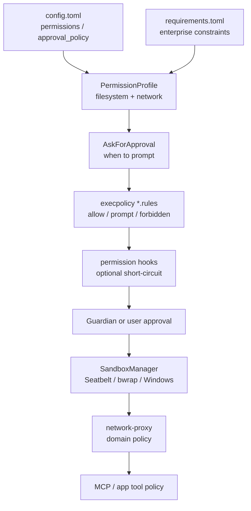
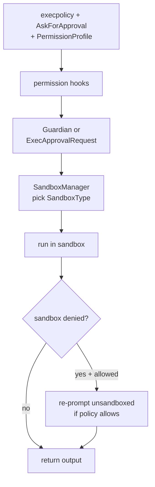
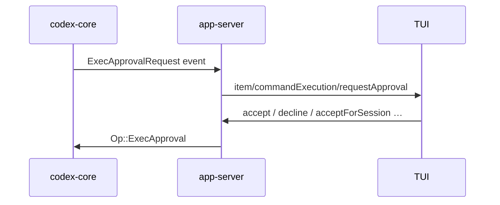

# Codex security design — sandbox, approvals, permissions

**English** | [中文](security-design_zh.md)

> **Answers:** How Codex stacks permission profiles, approvals, execpolicy, OS sandboxing, and network proxy into defense in depth — and how dangerous actions (shell / patch) flow through source.
> **Read first:** [architecture.md](architecture.md) · [layered-design.md](layered-design.md).
> **Verified against:** [openai/codex](https://github.com/openai/codex)@`da4c8ca` (2026-07-03) — re-check `git diff da4c8ca..HEAD -- codex-rs/` before trusting details.

> **Official product guide:** [Agent approvals & security](https://developers.openai.com/codex/agent-approvals-security)  
> **In-repo approvals RPC:** [app-server README § Approvals](https://github.com/openai/codex/blob/main/codex-rs/app-server/README.md)  
> **Execpolicy:** [execpolicy README](https://github.com/openai/codex/blob/main/codex-rs/execpolicy/README.md) · [Exec policy (official)](https://developers.openai.com/codex/exec-policy)

---

## One line

**Not a single switch.** Before the agent touches the system: **permission profile + approval policy + execpolicy rules**. At execution: **platform sandbox**. Egress: **managed network proxy**. User **`!` shell** and some APIs **intentionally bypass** the agent sandbox.

---

## Defense in depth (source layers)



| Layer | Primary crate / path | Role |
| ----- | -------------------- | ---- |
| Permission profile | `protocol/src/models.rs`, `config/permissions_toml.rs` | FS + network bounds |
| Approval policy | `protocol/src/protocol.rs` | When humans must consent |
| Command rules | `execpolicy/`, `core/src/exec_policy.rs` | Starlark per-command match |
| Orchestrator | `core/src/tools/orchestrator.rs` | Approve → sandbox → run → escalate |
| Platform sandbox | `sandboxing/`, `linux-sandbox/`, `windows-sandbox-rs/` | OS isolation |
| Network | `codex-network-proxy`, `core/tools/network_approval.rs` | Egress approval + persistence |
| Guardian | `core/src/guardian/` | Optional auto-reviewer subagent |
| Clients | `app-server`, `tui`, `mcp-server` | Approval UI ↔ JSON-RPC |

---

## Permission profile: `PermissionProfile`

Canonical runtime bounds (`protocol/src/models.rs`):

| Variant | Meaning |
| ------- | ------- |
| `Managed { file_system, network }` | Codex builds the sandbox (usual case) |
| `Disabled` | No outer sandbox |
| `External { network }` | FS isolated externally; Codex honors declared network only |

Built-in profile IDs:

| ID | Typical use |
| -- | ----------- |
| `:read-only` | Read-heavy |
| `:workspace` | Writable workspace (common default) |
| `:danger-full-access` | High privilege; often restricted in enterprise |

**Filesystem** (`protocol/src/permissions.rs`): path entries `read` / `write` / `deny` (**deny wins**); special paths like `:workspace_roots`, `:tmpdir`. Writable roots protect **`.git`, `.codex`, `.agents`** metadata by default.

**Network:** `NetworkSandboxPolicy` — `restricted` (default) or `enabled`; domain rules in `permissions_toml`. Official: [Permissions](https://developers.openai.com/codex/permissions).

---

## When to prompt: `AskForApproval`

Defined in `protocol/src/protocol.rs`:

| Value | Behavior |
| ----- | -------- |
| `unless-trusted` (`untrusted`) | Auto-approve only known-safe read-only; else ask |
| `on-request` (**default**) | Ask when policy says so |
| `granular({...})` | Per-flow toggles (table below) |
| `never` | Never ask; dangerous → forbidden or error back to model |

`GranularApprovalConfig` fields:

| Field | Controls |
| ----- | -------- |
| `sandbox_approval` | Shell / sandbox escalation prompts |
| `rules` | Execpolicy `prompt` rules |
| `skill_approval` | Skill script execution |
| `request_permissions` | `request_permissions` tool |
| `mcp_elicitations` | MCP elicitation prompts |

Also **`approvals_reviewer`**: `user` (default) or `auto_review` (Guardian).

---

## Command rules: execpolicy

`codex-execpolicy` Starlark `prefix_rule`:

```starlark
prefix_rule(
    pattern = ["git", "status"],
    decision = "prompt",
    justification = "…",
)
```

- Conflicts resolve to the **strictest** decision  
- `host_executable` pins which absolute paths may satisfy basename rules  
- Rules: `~/.codex/rules/`, project `rules/*.rules`  
- Local check: `codex execpolicy check`  

`core/src/exec_policy.rs` parses argv (including `bash -lc` wrappers) → `ExecApprovalRequirement`: `Skip` / `NeedsApproval` / `Forbidden`.

---

## Execution orchestration: `ToolOrchestrator`

`core/src/tools/orchestrator.rs` header:

> approval → select sandbox → attempt → retry with escalated sandbox on denial



**Patches (`apply_patch`)** use the same orchestrator; per-path approval cache in `core/tools/runtimes/apply_patch.rs`.

---

## Platform sandbox: `SandboxManager`

`SandboxType` (`sandboxing/src/manager.rs`):

| Variant | Platform | Implementation |
| ------- | -------- | -------------- |
| `MacosSeatbelt` | macOS | `/usr/bin/sandbox-exec` + `.sbpl` |
| `LinuxSeccomp` | Linux | `codex-linux-sandbox`: bubblewrap + seccomp |
| `WindowsRestrictedToken` | Windows | `codex-windows-sandbox` token backends |
| `None` | any | No outer sandbox |

| Platform | Notes |
| -------- | ----- |
| Linux | Default ro-bind `/`; WSL1 rejects bwrap |
| Windows | `windows_sandbox`: `disabled` / `restricted-token` / `elevated` |
| Remote | `exec-server` applies `FileSystemSandboxContext` |

See [linux-sandbox README](https://github.com/openai/codex/blob/main/codex-rs/linux-sandbox/README.md).

---

## Network & MCP

### Managed network proxy

When a turn has `NetworkProxy`, egress goes through `codex-network-proxy`:

- **Immediate** — block until approved  
- **Deferred** — approve after command succeeds  
- User may persist `NetworkPolicyAmendment`  

Logic: `core/tools/network_approval.rs`; Guardian may review `NetworkAccess`.

### MCP

| Mechanism | Location |
| --------- | -------- |
| Connector `AppToolPolicy` | `connectors/src/app_tool_policy.rs` |
| Tool-call Guardian | `core/src/mcp_tool_call.rs` |
| Elicitation granularity | `GranularApprovalConfig.mcp_elicitations` |
| Inbound MCP approvals | `mcp-server` · [codex_mcp_interface.md](https://github.com/openai/codex/blob/main/codex-rs/docs/codex_mcp_interface.md) |

---

## Client wiring (app-server / TUI)



Patches: `item/fileChange/requestApproval` → `Op::PatchApproval`.  
TUI does not enforce policy — it renders and returns decisions ([tui-interface-design.md](tui-interface-design.md)).

---

## Intentional bypasses (important)

| Path | Source / README |
| ---- | --------------- |
| TUI **`!` shell** | `thread/shellCommand` — **unsandboxed, full access** |
| **`process/spawn`** (experimental) | Explicitly unsandboxed per app-server README |
| **`External` profile** | FS enforced externally |
| **`PermissionProfile::Disabled`** | No outer sandbox |

> Agent `shell` tool ≠ user `!` shell — different trust boundaries.

---

## Config users touch

```toml
approval_policy = "on-request"
approvals_reviewer = "user"

default_permissions = ":workspace"

[permissions.myprofile]
extends = ":workspace"
[permissions.myprofile.filesystem]
":workspace_roots" = "write"
"/secrets" = "none"
[permissions.myprofile.network]
enabled = false
```

| Source | Role |
| ------ | ---- |
| `config.toml` | Defaults, Windows sandbox level |
| `rules/*.rules` | Execpolicy; amendments on approval |
| `requirements.toml` | Enterprise locks on policies / profiles / network |
| `thread/start`, `turn/start` | Per-thread / per-turn overrides |

Official: [Config reference](https://developers.openai.com/codex/config-reference) · [Permissions](https://developers.openai.com/codex/permissions) · [Sandboxing concept](https://developers.openai.com/codex/concepts/sandboxing).

TUI `/permissions` is the UI to change session policy — still app-server under the hood ([tui-commands.md](tui-commands.md)).

---

## Quick reference

| Question | Source answer |
| -------- | ------------- |
| Default strictness? | `on-request` + `:workspace` + platform sandbox + restricted network |
| Who blocks a command? | Execpolicy + `AskForApproval` + profile geometry |
| Where does it run? | `SandboxManager` per OS |
| No human in loop? | `never` / granular off / Guardian `auto_review` |
| Biggest holes? | User `!`, `process/spawn`, `danger-full-access` / Disabled |

---

## Related notes

| Doc | Link |
| --- | ---- |
| Architecture hub | [architecture.md](architecture.md) |
| Layering | [layered-design.md](layered-design.md) |
| TUI interfaces | [tui-interface-design.md](tui-interface-design.md) |