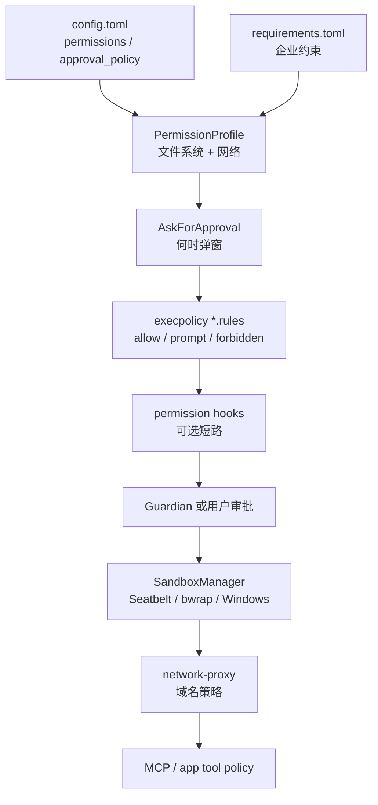
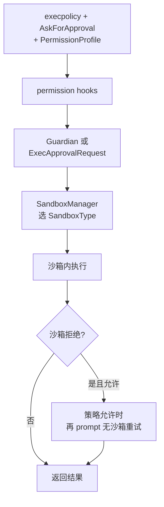
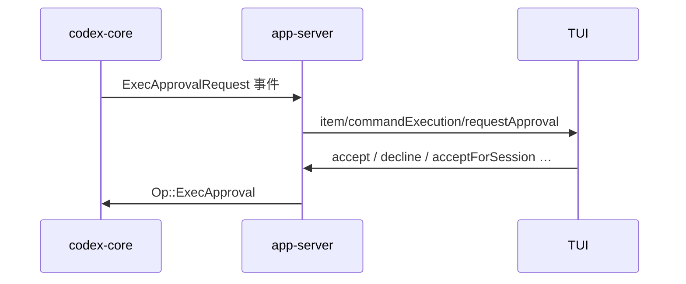

# Codex 安全设计 — 沙箱、审批与权限

[English](security-design.md) | **中文**

> **回答什么：** Codex 如何把「权限画像、审批、execpolicy、OS 沙箱、网络代理」叠成纵深防御；危险操作（shell / patch）在源码里怎么走。
> **读者前置：** [architecture_zh.md](architecture_zh.md) · [layered-design_zh.md](layered-design_zh.md)。
> **校验基准：** [openai/codex](https://github.com/openai/codex)@`da4c8ca`（2026-07-03）——引用细节前先 `git diff da4c8ca..HEAD -- codex-rs/` 确认是否漂移。

> **官方产品说明：** [Agent approvals & security](https://developers.openai.com/codex/agent-approvals-security)  
> **仓库 RPC 审批章节：** [app-server README § Approvals](https://github.com/openai/codex/blob/main/codex-rs/app-server/README.md)  
> **Execpolicy 语言：** [execpolicy README](https://github.com/openai/codex/blob/main/codex-rs/execpolicy/README.md) · [Exec policy（官方）](https://developers.openai.com/codex/exec-policy)

---

## 一句话

**不是单一开关。** Agent 动系统前要先过 **权限画像 + 审批策略 + execpolicy 规则**；执行时再套 **平台沙箱**；出站网络走 **托管代理**；用户显式的 **`!` shell** 和部分 API **刻意不走** agent 沙箱。

---

## 纵深防御（源码里的层）



| 层 | 主要 crate / 文件 | 做什么 |
| -- | ----------------- | ------ |
| 权限画像 | `protocol/src/models.rs`、`config/permissions_toml.rs` | 能读/写哪、网开不开 |
| 审批策略 | `protocol/src/protocol.rs` | 什么时候必须问人 |
| 命令规则 | `execpolicy/`、`core/src/exec_policy.rs` | Starlark 匹配每条 shell |
| 编排中枢 | `core/src/tools/orchestrator.rs` | 审批 → 沙箱 → 执行 → 失败可升级 |
| 平台沙箱 | `sandboxing/`、`linux-sandbox/`、`windows-sandbox-rs/` | OS 级隔离 |
| 网络 | `codex-network-proxy`、`core/tools/network_approval.rs` | 出站审批与持久化规则 |
| Guardian | `core/src/guardian/` | 可选自动审查子 agent |
| 客户端 | `app-server`、`tui`、`mcp-server` | 审批 UI ↔ JSON-RPC |

---

## 权限画像：`PermissionProfile`

运行时边界的**核心类型**（`protocol/src/models.rs`）：

| 变体 | 含义 |
| ---- | ---- |
| `Managed { file_system, network }` | Codex 自己构建沙箱（最常见） |
| `Disabled` | 不套外层沙箱 |
| `External { network }` | 文件系统由外部隔离；Codex 只处理声明的网络策略 |

内置 profile ID：

| ID | 典型用途 |
| -- | -------- |
| `:read-only` | 以读为主 |
| `:workspace` | 工作区可写（常见默认） |
| `:danger-full-access` | 高权限；企业常限制 |

**文件系统**（`protocol/src/permissions.rs`）：路径条目 `read` / `write` / `deny`（**deny 优先**）；支持 `:workspace_roots`、`:tmpdir` 等特殊路径。可写根下 **`.git`、`.codex`、`.agents`** 等有默认保护，避免 agent 改元数据。

**网络**：`NetworkSandboxPolicy` 为 `restricted`（默认）或 `enabled`；域名细则在 `permissions_toml` 配置。官方：[Permissions](https://developers.openai.com/codex/permissions)。

---

## 何时弹窗：`AskForApproval`

定义在 `protocol/src/protocol.rs`：

| 值 | 行为 |
| -- | ---- |
| `unless-trusted`（`untrusted`） | 仅「已知安全且只读」自动过；其余都问 |
| `on-request`（**默认**） | 策略/模型认为需要就问 |
| `granular({...})` | 按类开关（见下表） |
| `never` | 不问用户；危险命令直接 forbidden 或失败回模型 |

`GranularApprovalConfig` 可单独控制：

| 字段 | 控制什么 |
| ---- | -------- |
| `sandbox_approval` | shell / 提权沙箱请求 |
| `rules` | execpolicy 的 `prompt` 规则 |
| `skill_approval` | skill 脚本执行 |
| `request_permissions` | `request_permissions` 工具 |
| `mcp_elicitations` | MCP 交互式审批 |

还可选 **`approvals_reviewer`**：`user`（默认）或 `auto_review`（Guardian 子 agent 先审）。

---

## 命令规则：execpolicy

`codex-execpolicy` 用 Starlark `prefix_rule`：

```starlark
prefix_rule(
    pattern = ["git", "status"],
    decision = "prompt",   # allow | prompt | forbidden
    justification = "…",
)
```

- 多规则冲突取**最严**决策  
- `host_executable` 可约束「`git` 只能从哪些绝对路径执行」  
- 规则文件：`~/.codex/rules/`、项目 `rules/*.rules`  
- 本地检查：`codex execpolicy check`  

`core/src/exec_policy.rs` 在跑命令前解析 argv（含 `bash -lc` 包装），产出 `ExecApprovalRequirement`：`Skip` / `NeedsApproval` / `Forbidden`。

---

## 执行编排：`ToolOrchestrator`

`core/src/tools/orchestrator.rs` 模块注释：

> approval → select sandbox → attempt → retry with escalated sandbox on denial



**Patch（`apply_patch`）** 走同一编排器；另有按路径的审批缓存（`core/tools/runtimes/apply_patch.rs`）。

---

## 平台沙箱：`SandboxManager`

`SandboxType`（`sandboxing/src/manager.rs`）：

| 变体 | 平台 | 实现要点 |
| ---- | ---- | -------- |
| `MacosSeatbelt` | macOS | `/usr/bin/sandbox-exec` + `.sbpl` 模板 |
| `LinuxSeccomp` | Linux | `codex-linux-sandbox`：bubblewrap + seccomp（Landlock 可选） |
| `WindowsRestrictedToken` | Windows | `codex-windows-sandbox` restricted token / elevated |
| `None` | 任意 | 无外层沙箱 |

| 平台 | 备注 |
| ---- | ---- |
| Linux | 默认 ro-bind `/`，可写根单独 bind；WSL1 不支持 bwrap |
| Windows | `windows_sandbox`：`disabled` / `restricted-token` / `elevated` |
| 远程 | `exec-server` 收 `FileSystemSandboxContext`，在远端复用变换逻辑 |

Linux 细节见 [linux-sandbox README](https://github.com/openai/codex/blob/main/codex-rs/linux-sandbox/README.md)。

---

## 网络与 MCP

### 托管网络代理

Turn 带 `NetworkProxy` 时，出站经 `codex-network-proxy`：

- **Immediate** — 连接被拦就立刻审批  
- **Deferred** — 命令成功后再批网络  
- 用户可批单次或持久化 `NetworkPolicyAmendment`  

逻辑在 `core/tools/network_approval.rs`；Guardian 可审 `NetworkAccess`。

### MCP

| 机制 | 位置 |
| ---- | ---- |
| 连接器 `AppToolPolicy` | `connectors/src/app_tool_policy.rs` |
| 工具调用 Guardian | `core/src/mcp_tool_call.rs` |
| Elicitation 粒度 | `GranularApprovalConfig.mcp_elicitations` |
| 入站 MCP 审批 | `mcp-server` · [codex_mcp_interface.md](https://github.com/openai/codex/blob/main/codex-rs/docs/codex_mcp_interface.md) |

---

## 客户端如何接上（app-server / TUI）



Patch 对应 `item/fileChange/requestApproval` → `Op::PatchApproval`。  
TUI **不**自己判安全，只展示与回传（见 [tui-interface-design_zh.md](tui-interface-design_zh.md)）。

---

## 刻意不走 agent 沙箱的路径（重要）

| 路径 | 源码 / README 说明 |
| ---- | ------------------ |
| TUI **`!` shell** | `thread/shellCommand` — **无沙箱、全权限**，不继承 thread 沙箱 |
| **`process/spawn`**（实验） | app-server README：明确无沙箱 |
| **`External` 画像** | FS 由外部负责 |
| **`PermissionProfile::Disabled`** | 不套外层沙箱 |

> Agent 的 `shell` 工具与用户的 `!` 是**两条路**；后者是「用户 shell」，不是 agent 工具链。

---

## 用户 / 企业常碰的配置

```toml
approval_policy = "on-request"
approvals_reviewer = "user"          # 或 auto_review

default_permissions = ":workspace"

[permissions.myprofile]
extends = ":workspace"
[permissions.myprofile.filesystem]
":workspace_roots" = "write"
"/secrets" = "none"                  # deny
[permissions.myprofile.network]
enabled = false
```

| 配置源 | 作用 |
| ------ | ---- |
| `config.toml` | 默认权限、审批、Windows 沙箱级别 |
| `rules/*.rules` | execpolicy；审批时可提议 amendment 持久化 allow |
| `requirements.toml` | 企业锁：允许的 approval/sandbox/profile、托管 hooks、网络域名等 |
| `thread/start`、`turn/start` | 单 thread / 单 turn 覆盖 approval、permissions |

官方：[Config reference](https://developers.openai.com/codex/config-reference) · [Permissions](https://developers.openai.com/codex/permissions) · [Sandboxing 概念](https://developers.openai.com/codex/concepts/sandboxing)。

TUI `/permissions` 是改当前会话权限的 UI 入口，底层仍走 app-server 设置 API（见 [tui-commands_zh.md](tui-commands_zh.md)）。

---

## 快速对照表

| 问题 | 源码答案 |
| ---- | -------- |
| 默认有多严？ | `on-request` + `:workspace` + 平台沙箱 + 网络 restricted |
| 谁决定能不能跑？ | execpolicy + `AskForApproval` + 权限几何 |
| 谁决定跑在哪？ | `SandboxManager` 按 OS 包一层 |
| 人不在 loop？ | `never` / granular 关某类；或 Guardian `auto_review` |
| 最大洞？ | 用户 `!`、`process/spawn`、`danger-full-access` / Disabled |

---

## 相关笔记

| 文档 | 链接 |
| ---- | ---- |
| 架构 hub | [architecture_zh.md](architecture_zh.md) |
| 分层 | [layered-design_zh.md](layered-design_zh.md) |
| TUI 接口 | [tui-interface-design_zh.md](tui-interface-design_zh.md) |