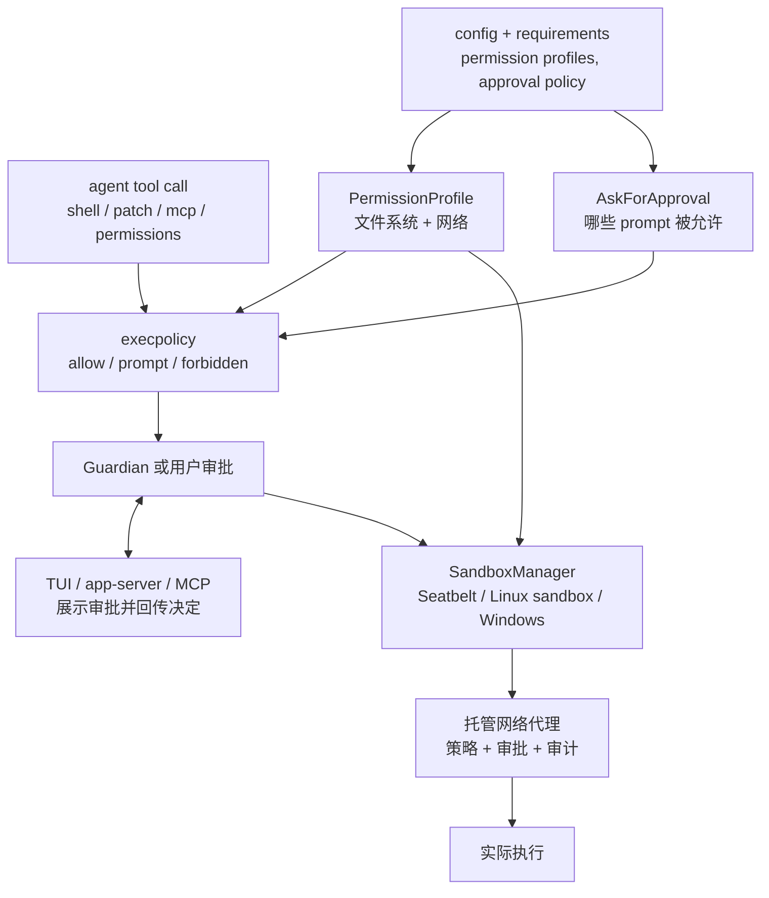
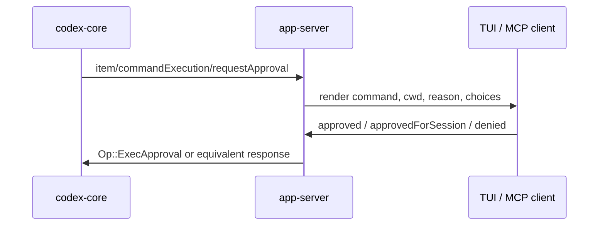

# Codex 安全设计 - 沙箱、审批与权限

[English](security-design.md) | **中文**

> **回答什么：** Codex 如何把 agent 动作变成受边界约束的 runtime 决策：权限画像定义能力边界，审批策略定义什么时候问，execpolicy 给命令分类，平台沙箱强制文件系统/网络限制，客户端负责展示审批请求。
> **读者前置：** [architecture_zh.md](architecture_zh.md) · [layered-design_zh.md](layered-design_zh.md)。
> **校验基准：** [openai/codex](https://github.com/openai/codex)@`da4c8ca`（2026-07-03）——引用细节前先 `git diff da4c8ca..HEAD -- codex-rs/` 确认是否漂移。

> **官方产品说明：** [Agent approvals & security](https://developers.openai.com/codex/agent-approvals-security)  
> **仓库 RPC 审批章节：** [app-server README § Approvals](https://github.com/openai/codex/blob/main/codex-rs/app-server/README.md)  
> **Execpolicy 语言：** [execpolicy README](https://github.com/openai/codex/blob/main/codex-rs/execpolicy/README.md) · [Exec policy（官方）](https://developers.openai.com/codex/exec-policy)

---

## 一句话

Codex 的安全边界不是模型承诺，也不是单个 sandbox 开关。它是一条 runtime 管线：**权限画像**限定能访问什么，**审批策略**决定是否需要用户或 reviewer 同意，**execpolicy**给命令风险分类，**平台沙箱**强制文件系统/网络限制，**网络代理 / Guardian / 客户端**补上审查、审计和 UI 中介。

`full-access`、用户 `!` shell、`process/spawn`、`External` profile 都是显式的信任边界出口。它们是刻意设计的 escape hatch，不是普通 agent 执行路径。

---

## 心智模型



重点不是一条纯线性链路，而是多路 fan-in：`PermissionProfile`、`AskForApproval`、execpolicy rules、单 turn 授权和平台能力会在执行时一起合成最终决策。

---

## 源码地图

| 层 | 主要源码 | 重点看什么 |
| -- | -------- | ---------- |
| 权限画像 | `codex-rs/protocol/src/models.rs` | `PermissionProfile::{Managed, Disabled, External}` 和内置 ID |
| 文件系统 / 网络策略 | `codex-rs/protocol/src/permissions.rs` | `FileSystemSandboxPolicy`、`NetworkSandboxPolicy`、受保护 metadata |
| 配置编译 | `codex-rs/core/src/config/permissions.rs`、`codex-rs/config/src/permissions_toml.rs` | 内置 profile 解析、自定义 profile 继承 |
| 审批 preset | `codex-rs/utils/approval-presets/src/lib.rs` | UI 无关的 read-only/default/full-access preset |
| 命令策略 | `codex-rs/core/src/exec_policy.rs`、`codex-rs/execpolicy/` | allow/prompt/forbidden、prefix amendment |
| 工具编排 | `codex-rs/core/src/tools/sandboxing.rs`、`codex-rs/core/src/tools/handlers/unified_exec/exec_command.rs` | 审批需求、追加权限、denied-read 保持 |
| 平台沙箱 | `codex-rs/sandboxing/`、`codex-rs/linux-sandbox/`、`codex-rs/windows-sandbox-rs/` | Seatbelt、bubblewrap/seccomp/Landlock、Windows restricted token/elevated wrapper |
| 网络 | `codex-rs/network-proxy/`、`codex-rs/core/src/tools/network_approval.rs` | 托管代理、host 决策、网络审批流 |
| Guardian | `codex-rs/core/src/guardian/` | 自动 reviewer、fail-closed 审查、有上限的 transcript |
| 客户端 | `codex-rs/app-server/`、`codex-rs/tui/`、`codex-rs/mcp-server/` | JSON-RPC 审批请求和 UI/elicitation 接线 |
| secrets / hardening | `codex-rs/secrets/`、`codex-rs/login/`、`codex-rs/process-hardening/` | 尽力脱敏、auth 存储、pre-main 进程加固 |

---

## 权限画像：能力边界

`PermissionProfile` 是主要的能力边界：

| 变体 | 含义 |
| ---- | ---- |
| `Managed { file_system, network }` | Codex 负责用平台沙箱和网络策略执行限制 |
| `Disabled` | 没有 Codex 外层沙箱；对应 danger/full access |
| `External { network }` | 文件系统隔离由外部负责；Codex 仍记录声明的网络状态 |

内置 profile ID：

| ID | runtime 形态 |
| -- | ------------ |
| `:read-only` | 文件系统受限只读，网络 restricted |
| `:workspace` | workspace 可写，网络默认 restricted，除非配置启用 |
| `:danger-full-access` | `PermissionProfile::Disabled` |

文件系统条目使用 `read`、`write`、`deny`。当同等具体程度的条目冲突时，`deny` 优先于 `write`，`write` 优先于 `read`。特殊路径包括 `:root`、`:minimal`、`:workspace_roots`、`:tmpdir`、`:slash_tmp`。

另一个关键点是 workspace metadata 保护：即使 workspace 可写，顶层 `.git`、`.agents`、`.codex` 也很敏感，因为它们能影响 hooks、指令或 Codex 行为。在 restricted 模式下，agent 写这些路径会被拦，除非策略显式给该 metadata 路径写权限。

---

## 审批策略：prompt 边界

`AskForApproval` 回答的是另一个问题：不是“能访问什么”，而是“这里是否允许 Codex 请求同意”。

| 值 | 行为 |
| -- | ---- |
| `untrusted` / `unless-trusted` | 只自动放行已知安全且只读的命令；其余要问 |
| `on-request` | 当策略或 sandbox escalation 需要时询问 |
| `granular({...})` | 按 prompt 类型单独允许或拒绝 |
| `never` | 不询问；需要审批的流程会变成 forbidden 或错误返回 |

`GranularApprovalConfig` 目前控制：

| 字段 | 控制什么 |
| ---- | -------- |
| `sandbox_approval` | sandbox escape / shell escalation prompt |
| `rules` | execpolicy `prompt` 规则 |
| `skill_approval` | skill 脚本审批 |
| `request_permissions` | 独立 `request_permissions` 工具 prompt |
| `mcp_elicitations` | MCP elicitation prompt |

`approvals_reviewer` 决定审批请求交给谁。`user` 会展示给人；`auto_review` 会在支持的流程中交给 Guardian 做基于风险的 allow/deny。

---

## Preset：产品模式只是组合

UI 里看到的审批模式，本质是审批策略 + 权限画像的小组合：

| Preset | 审批 | 权限画像 |
| ------ | ---- | -------- |
| Read Only | `on-request` | `:read-only` |
| Default / Agent mode | `on-request` | `:workspace` |
| Full Access | `never` | `:danger-full-access` / `Disabled` |

所以 “default” 不是“不问问题”，而是 workspace 可写、网络受限，并且越界动作需要审批。

---

## 命令规则：execpolicy

Agent shell 执行前会先被分类。`core/src/exec_policy.rs` 会解析命令，包括 `bash -lc` 这类常见 shell wrapper，然后执行 execpolicy 规则。结果会变成：

| 结果 | 含义 |
| ---- | ---- |
| `Skip` | 不需要审批 |
| `NeedsApproval` | 需要问用户或 Guardian |
| `Forbidden` | 不 prompt，直接拒绝 |

规则可以产出 `allow`、`prompt`、`forbidden`。被批准的 prompt 还可以提出 amendment，让未来匹配的命令跳过重复审批。

两个防御细节值得注意：

- 复杂解析仍参与规则判断，但如果只有复杂 fallback parser 命中，Codex 不会自动生成持久化 amendment。
- 过宽的 prefix suggestion 会被禁止，比如 `python -c`、`bash -lc`、`sudo`、`node -e` 等，因为批准它们几乎等于批准任意代码。

---

## 工具执行流

主 agent 的 `exec_command` 路径大致是：

1. 解析工具参数，定位目标 environment/cwd。
2. 根据有效文件系统/网络策略选择初始 sandbox 类型。
3. 校验并规范化请求的 additional permissions。
4. 必要时拦截 `apply_patch` 风格调用。
5. 把 command、cwd、network proxy、sandbox permissions、approval metadata 交给 `UnifiedExecProcessManager` 执行。
6. 如果 sandbox denial 已经是终态，就返回 denial output，而不是留下可恢复进程。

这里最重要的不变量是：“approved” 不总是等于 “unsandboxed”。如果文件系统策略里有 denied-read 限制，绕过 sandbox 会丢掉 enforce deny-read 的唯一机制，所以 Codex 会保留 sandbox。

---

## 平台沙箱：真正执行限制

`SandboxManager` 只在有效策略需要、且宿主平台支持时选择平台实现。

| `SandboxType` | 平台 | 实现要点 |
| ------------- | ---- | -------- |
| `MacosSeatbelt` | macOS | `/usr/bin/sandbox-exec` + 生成的 SBPL |
| `LinuxSeccomp` | Linux | `codex-linux-sandbox` wrapper、bubblewrap 文件系统视图、seccomp / Landlock 路径 |
| `WindowsRestrictedToken` | Windows | Windows sandbox wrapper，restricted-token 或 elevated backend |
| `None` | 任意 | 没有 Codex 平台沙箱 |

几个重要细节：

- macOS 固定使用绝对路径 `/usr/bin/sandbox-exec`，避免 PATH 注入。
- Linux 把文件系统建模成默认只读，再叠加 writable roots；`.git`、`.agents`、`.codex` 即使在 writable root 下也保持保护。
- Windows direct-spawn 请求会包一层 sandbox helper，并且 setup 环境变量使用窄 allowlist。
- `External` 表示 Codex 不负责文件系统隔离；这个边界交给外部环境。

---

## 网络：独立的出站边界

网络访问没有混进文件系统权限，而是单独的 `NetworkSandboxPolicy`：

| 值 | 含义 |
| -- | ---- |
| `restricted` | 默认；出站网络被阻断或托管 |
| `enabled` | 该 profile 拥有完整网络访问 |

启用托管网络时，命令会收到 proxy 设置，流量走 `codex-network-proxy`。这个 proxy 有 host/domain 决策、审计事件和 blocked-request observer。被拦的 host 可以变成审批请求：

| 决策 | 效果 |
| ---- | ---- |
| allow once | 允许这一次请求 |
| allow for session | 本 session 缓存 host/protocol/port |
| deny | 阻断并返回拒绝 |

当 `AskForApproval::Never` 时，网络审批流也不会启动；策略 miss 不能被转换成人类 prompt。

---

## Guardian：自动 reviewer，不是 enforcement

Guardian 是支持流程中的审批 reviewer。模块级契约是：

1. 围绕当前动作重建有上限的 transcript。
2. 让独立 review session 评估这个精确动作。
3. 要求严格 JSON，包含 risk、authorization、outcome、rationale。
4. 超时、执行失败、输出格式错误时 fail closed。
5. 应用明确的 allow/deny outcome。

Guardian 不是 sandbox。它可以批准或拒绝 prompt，但真正 enforcement 仍在正常的 tool/runtime/sandbox 路径里。

---

## 客户端接线：app-server / TUI / MCP

客户端负责展示审批请求；它们不自己决定底层 policy。



审批类型包括：

| 请求 | 示例来源 |
| ---- | -------- |
| 命令执行 | `item/commandExecution/requestApproval` |
| 文件变更 | `item/fileChange/requestApproval` |
| 权限请求 | `item/permissions/requestApproval` |
| MCP elicitation | `elicitation/create` / app-server request plumbing |
| Guardian denied action override | `thread/approveGuardianDeniedAction` |

MCP 审批处理偏保守：如果 exec approval response 无法解析，MCP server 会当作 denied。

---

## 刻意绕过普通 agent 沙箱的路径

这些路径按设计不属于普通 agent sandbox 语义：

| 路径 | 边界 |
| ---- | ---- |
| TUI `!` / `thread/shellCommand` | 用户主动发起的 shell command；无沙箱、全权限 |
| `process/spawn` | 实验性 app-server process API；明确无沙箱 |
| `PermissionProfile::Disabled` / `:danger-full-access` | 没有 Codex 外层沙箱 |
| `PermissionProfile::External` | 文件系统隔离交给外部 sandbox |

Agent `exec_command` 和用户 `!` shell 是不同信任边界。不要用其中一个推断另一个。

---

## Secrets、auth 与进程加固

安全设计不只是 sandbox：

- `codex-secrets` 会对常见 secret 形态做 best-effort 脱敏，例如 OpenAI key、AWS access key、Bearer token、`token/password/api_key` 赋值。
- `login/src/auth/storage.rs` 支持 keyring auth storage；fallback 的 `auth.json` 在 Unix 下用 `0600` 权限写入。
- `process-hardening` 在支持的 Unix 平台做 pre-main 加固：禁 core dump、尽量禁止 ptrace attach、移除 `LD_*` / `DYLD_*` 等危险动态加载环境变量。
- app-server websocket auth 支持 capability token 和 signed bearer token；未认证的非 loopback listener 会被识别为不安全。

这些是主 agent 执行路径周围的 defense-in-depth 控制。

---

## 用户 / 企业常碰的配置

```toml
approval_policy = "on-request"
approvals_reviewer = "user"

default_permissions = ":workspace"

[permissions.myprofile]
extends = ":workspace"

[permissions.myprofile.filesystem]
":workspace_roots" = "write"
"/secrets" = "deny"

[permissions.myprofile.network]
enabled = false
```

| 配置源 | 作用 |
| ------ | ---- |
| `config.toml` | 本地默认值：审批策略、权限画像、Windows sandbox 设置 |
| `permissions.*` profiles | 命名文件系统/网络策略，可继承 |
| `rules/*.rules` | execpolicy 命令决策和持久化 amendment |
| `requirements.toml` | 企业约束：profile、policy、network、rules 等 |
| `thread/start`、`turn/start`、`command/exec` | API 级覆盖；优先用 `permissions` / `permissionProfile`，而不是旧 sandbox 字段 |

官方：[Config reference](https://developers.openai.com/codex/config-reference) · [Permissions](https://developers.openai.com/codex/permissions) · [Sandboxing 概念](https://developers.openai.com/codex/concepts/sandboxing)。

---

## 快速对照表

| 问题 | 源码答案 |
| ---- | -------- |
| 默认有多严？ | `on-request` + `:workspace` + 网络 restricted + 需要时的平台沙箱 |
| 谁会挡住命令？ | execpolicy、审批策略、权限画像、sandbox 能力 |
| 谁 enforce 文件访问？ | 平台沙箱 + 显式 metadata/write 检查 |
| 谁 enforce 网络访问？ | network sandbox policy + 启用时的托管 proxy |
| approved 命令还会在沙箱里吗？ | 会；denied-read 规则必须保持可 enforce |
| 人不在 loop？ | `never`、granular 关闭某类 prompt，或配置了 Guardian `auto_review` |
| 最大的显式出口？ | `!` shell、`process/spawn`、`:danger-full-access`、`External` |

---

## 相关笔记

| 文档 | 链接 |
| ---- | ---- |
| 架构 hub | [architecture_zh.md](architecture_zh.md) |
| 分层 | [layered-design_zh.md](layered-design_zh.md) |
| TUI 接口 | [tui-interface-design_zh.md](tui-interface-design_zh.md) |
