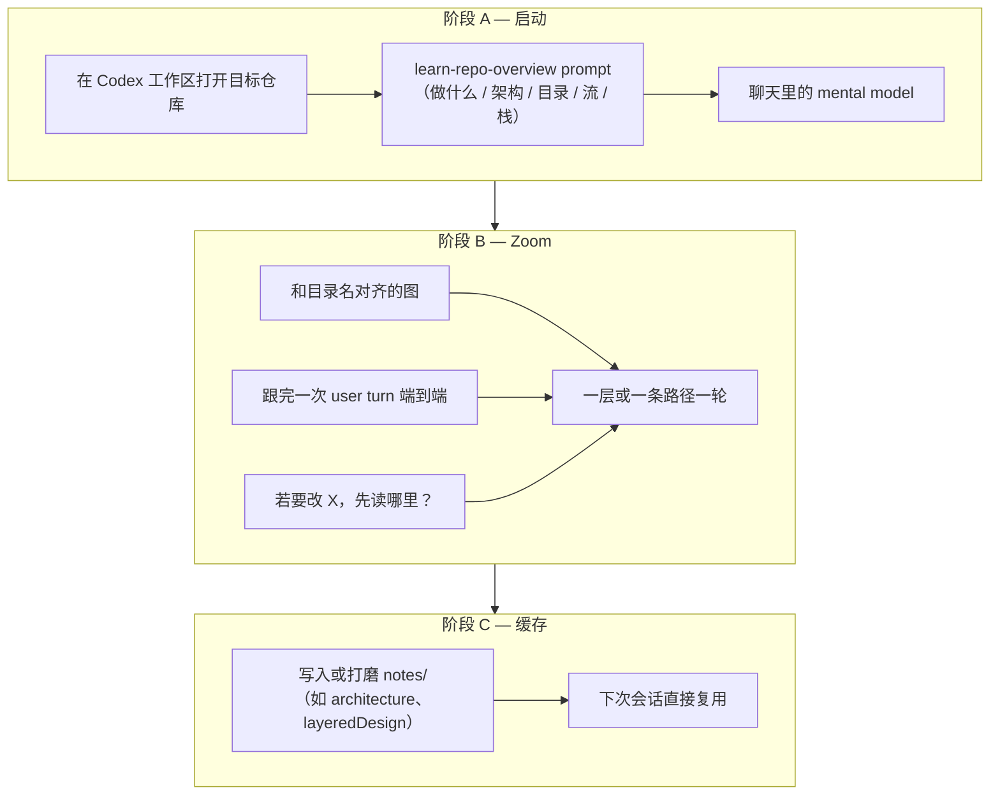
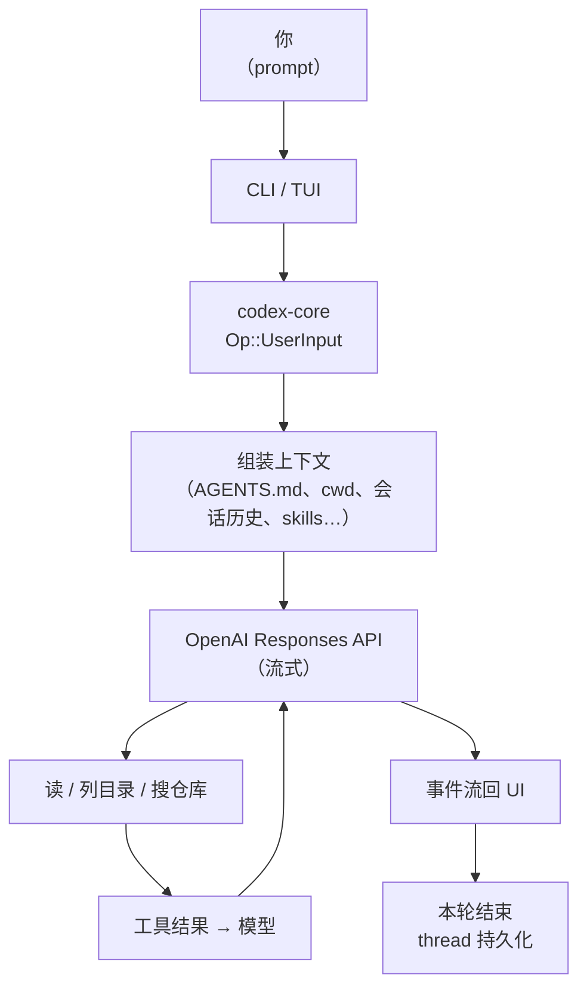
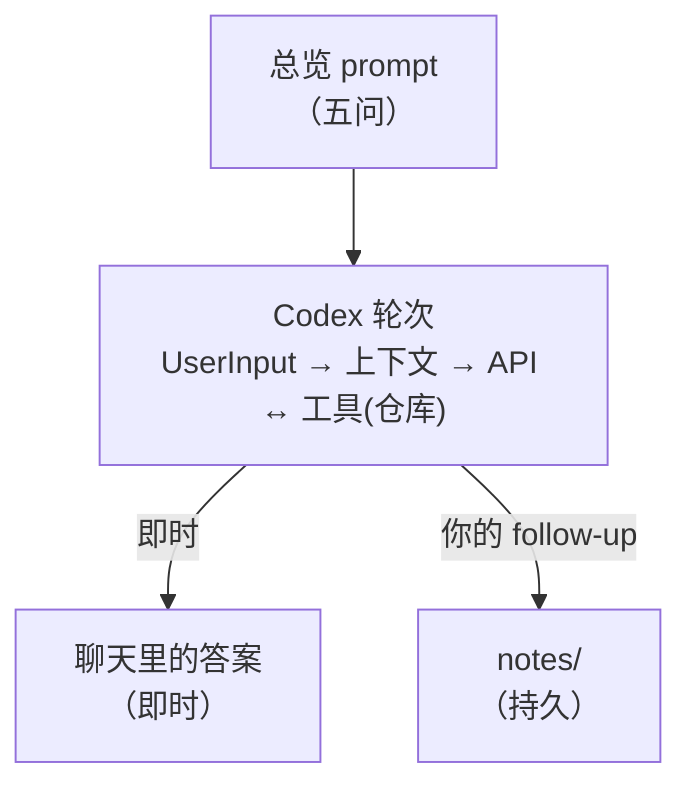

# 学习代码库 — 从 prompt 到结果

[English](learn-codebase-flow.md) | **中文**

**学习一次代码库**时，整条链路怎么串：你的 prompt、Codex 运行时做了什么、以及沉淀在 `notes/` 里的持久结果。

> 案例：[005-learn-codex-repo](../cases/005-learn-codex-repo/case_zh.md) · Prompt：[learn-repo-overview_zh.md](../prompts/learn-repo-overview_zh.md) · 示例产出：[architecture_cn.md](architecture_cn.md)

---

## 两条链（叠在一起）

| 链               | 回答什么问题                              |
| ---------------- | ----------------------------------------- |
| **Lab 工作流**   | *你* 在多轮里做什么 — 总览 → zoom → notes |
| **Codex 运行时** | *单轮内部* 发生什么 — 输入 → 工具 → 回复  |

两条都要看：运行时产出聊天里的答案；lab 工作流把它变成可复用的东西。

---

## 1. Lab 工作流（prompt → 持久结果）



| 阶段 | 输入                    | 输出                     |
| ---- | ----------------------- | ------------------------ |
| A    | 一份结构化 prompt       | 聊天里的五段总览         |
| B    | 短 follow-up            | 更深切片（图、一条路径） |
| C    | 你整理 / 「存进 notes」 | `notes/` 下的文件        |

**第一版结果** 是对话回复。**值得保留的结果** 是阶段 C。

---

## 2. Codex 运行时（一轮学习请求）

当你要仓库总览时，每一轮大致走这条路径（系统全貌见 [architecture_cn.md](architecture_cn.md)）：



**一行版：**

```text
prompt → UserInput → 上下文 → 模型 ↔ 工具(仓库) → 流式回复 → （你）notes/
```

**学代码库**时，工具循环是关键：模型会读 `README`、manifest、crate 布局、入口 — 再综合成你的五问答案，不只靠预训练。

### IDE / SDK 变体

IDE、桌面端和 Python SDK 使用同一套 core，走 JSON-RPC（`app-server`）：`thread/start` → `turn/start` → 事件流 → `turn/completed`。TypeScript SDK 则包装 `codex exec --experimental-json`，通过 stdin/stdout JSONL 通信。详见 [architecture_cn.md § 请求如何流转](architecture_cn.md#请求如何流转)。

---

## 3. 两条链怎么接上



[案例 004](../cases/004-bigtech-infra/case_zh.md)：受访者说 Codex 适合 **代码解读**。[案例 005](../cases/005-learn-codex-repo/case_zh.md)：Anne 在 [openai/codex](https://github.com/openai/codex) 上试通 → **codex-labs** 用来缓存 notes。

---

## 4. 最短路径

```text
1. 在 Codex 里打开仓库
2. 一个总览 prompt（要地图，不要逐行）
3. 核对 + zoom（图、一条请求路径、「改 X 读哪」）
4. 写进 notes/ — 这才是要留的结果
5. 下次：先读 notes，再问具体问题
```

---

## 相关文档

| 文档                                                              | 作用                                 |
| ----------------------------------------------------------------- | ------------------------------------ |
| [learn-repo-overview_zh.md](../prompts/learn-repo-overview_zh.md) | 可复制的第一轮 prompt                |
| [architecture_cn.md](architecture_cn.md)                          | Codex *是什么*（用这条链路学出来的） |
| [layeredDesign_cn.md](layeredDesign_cn.md)                        | 阶段 B 对 Codex 分层的 zoom          |
| [agents-md_cn.md](agents-md_cn.md)                                | 启动后的持续约束                     |
