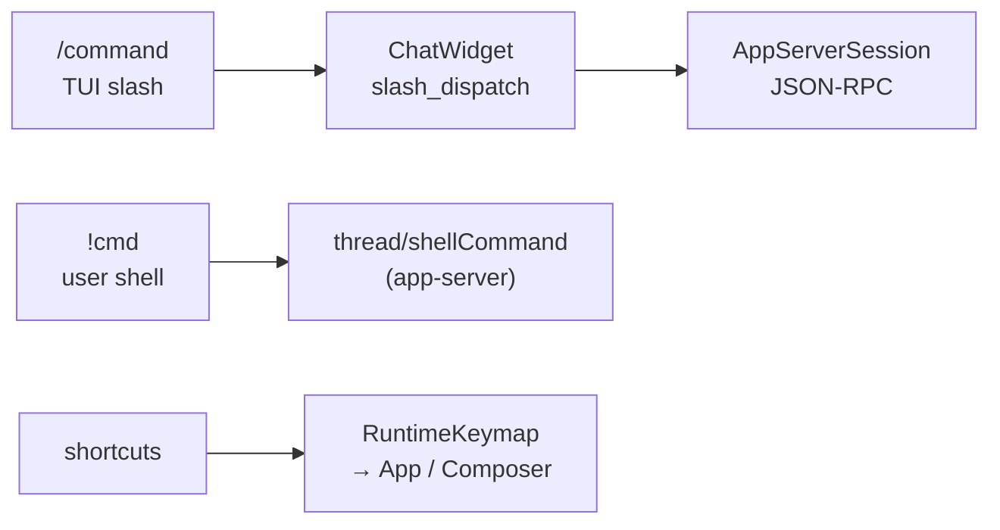

# TUI commands — slash, shell, shortcuts

**English** | [中文](tui-commands_cn.md)

User-facing **commands** in the Codex terminal UI: chat **`/slash`**, **`!` shell**, and **keyboard shortcuts**. For layering see [tui-interface-design.md](tui-interface-design.md).

> **Official docs (check first):** [CLI Slash commands](https://developers.openai.com/codex/cli/slash-commands) · [CLI reference](https://developers.openai.com/codex/cli/reference) · [CLI Features](https://developers.openai.com/codex/cli/features)  
> **Source enum:** [`codex-rs/tui/src/slash_command.rs`](https://github.com/openai/codex/blob/main/codex-rs/tui/src/slash_command.rs)  
> **Backend RPC:** most slash actions map to [app-server](https://developers.openai.com/codex/app-server) methods

Type **`/`** in the composer to see the filtered completion list for your environment.

---

## Three input kinds

| Kind | Form | Notes |
| ---- | ---- | ----- |
| Slash | `/model`, `/status`, … | Built into TUI; table below |
| Shell | `!git status` | User shell via [thread/shellCommand](https://github.com/openai/codex/blob/main/codex-rs/app-server/README.md#api-overview) |
| Shortcuts | `Ctrl+T`, `Esc`, … | Defaults in `keymap.rs`; change via `/keymap` or `tui.keymap` |

---

## Built-in slash commands (source enum)

Names from `SlashCommand`; **aliases** listed separately. Visibility depends on features, platform, and context.

### Session & thread

| Command | Purpose | Aliases / notes |
| ------- | ------- | --------------- |
| `/new` | New chat mid-conversation | Not during active task |
| `/resume` | Resume saved chat | Supports args |
| `/fork` | Fork current chat | Not during active task |
| `/rename` | Rename thread | Supports args |
| `/archive` | Archive and exit | Not during active task |
| `/delete` | Delete and exit | Not during active task |
| `/clear` | Clear terminal + new chat | Not during active task |
| `/quit` `/exit` | Exit Codex | |
| `/app` | Continue in Codex Desktop | macOS / Windows only |

### Model & modes

| Command | Purpose |
| ------- | ------- |
| `/model` | Model + reasoning effort |
| `/plan` | Plan mode | Needs collaboration modes |
| `/goal` | Long-running task goal | `/goooal` variants work |
| `/personality` | Communication style | Feature-gated |
| `/permissions` | Approval policy | [Permissions](https://developers.openai.com/codex/permissions) |
| `/approve` | Retry auto-review denial | Canonical name `approve` |

Dynamic **service tier** entries may appear under `/model` when enabled.

### Agents

| Command | Purpose |
| ------- | ------- |
| `/agent` | Switch active agent thread |
| `/subagents` | Same |
| `/side` `/btw` | Side conversation in ephemeral fork | Supports args |

### Context & tools

| Command | Purpose |
| ------- | ------- |
| `/compact` | Compact history | → `thread/compact/start` |
| `/review` | Review changes | Supports args |
| `/diff` | Git diff | |
| `/mention` | @ mention file | |
| `/skills` | Skills | [Skills docs](https://developers.openai.com/codex/skills) |
| `/mcp` | List MCP tools | `/mcp verbose` |
| `/hooks` | Lifecycle hooks | [Hooks](https://developers.openai.com/codex/hooks) |
| `/import` | Import from Claude Code | |
| `/init` | Create `AGENTS.md` | [AGENTS.md guide](https://developers.openai.com/codex/guides/agents-md) |
| `/ide` | IDE context | Supports args |

### Status & debug

| Command | Purpose |
| ------- | ------- |
| `/status` | Session config + tokens | |
| `/usage` | Usage / reset credits | ChatGPT login required |
| `/debug-config` | Config layer debug | |
| `/rollout` | Rollout file path | Debug builds only |
| `/test-approval` | Test approval UI | Debug builds only |

### UI customization

| Command | Purpose |
| ------- | ------- |
| `/keymap` | Remap shortcuts | [Config reference](https://developers.openai.com/codex/config-reference) |
| `/vim` | Vim composer mode | |
| `/theme` | Syntax theme | |
| `/title` | Terminal title items | |
| `/statusline` | Status line items | |
| `/pets` | Terminal pet | Alias `/pet` |
| `/raw` | Raw scrollback | `on`/`off` args |
| `/copy` | Copy last reply | Hidden on Android |

### Sandbox & integrations

| Command | Purpose |
| ------- | ------- |
| `/setup-default-sandbox` | Elevated sandbox setup | |
| `/sandbox-add-read-dir` | Grant sandbox read dir | Windows only |
| `/experimental` | Experimental features | |
| `/memories` | Memory settings | [Memories](https://developers.openai.com/codex/memories) |
| `/apps` | Connectors | Feature-gated |
| `/plugins` | Plugins | Feature-gated |
| `/logout` | Log out | [Auth](https://developers.openai.com/codex/auth) |
| `/feedback` | Send logs to maintainers | |
| `/ps` | List background terminals | |
| `/stop` | Stop background terminals | Alias `/clean` |

---

## Visibility & context rules

| Condition | Effect |
| --------- | ------ |
| Collaboration modes off | No `/plan` |
| Connectors off | No `/apps` |
| Plugins off | No `/plugins` |
| **Side conversation** | Most slash disabled; `/copy`, `/raw`, `/diff`, `/status`, `/usage`, `/ide` remain |
| **Task running** | `/new`, `/compact`, `/theme`, … blocked; `/status`, `/goal`, … still work |
| Queue while task runs | Type slash then **`Tab`** to queue for next turn |

---

## Default shortcuts

Inspect and persist via **`/keymap`** → `tui.keymap` in config. Defaults: [`keymap.rs` `built_in_defaults`](https://github.com/openai/codex/blob/main/codex-rs/tui/src/keymap.rs).

| Key | Action |
| --- | ------ |
| `Enter` | Submit |
| `Tab` | Queue while running; submit when idle |
| `Ctrl+R` | Reverse history search |
| `Esc` | Interrupt turn |
| `Ctrl+C` | Interrupt / dismiss / double-press quit |
| `Ctrl+D` | Quit (double-press) |
| `Ctrl+T` | Transcript overlay |
| `Ctrl+O` | Copy last agent reply |
| `Ctrl+L` | Clear terminal |
| `Ctrl+G` | External editor |
| `Alt+R` | Toggle raw scrollback |
| `Alt+,` / `Alt+.` | Decrease / increase reasoning effort |
| `?` | Shortcut overlay |

---

## CLI subcommands (shell `codex …`, not chat slash)

| Subcommand | Role | Docs |
| ---------- | ---- | ---- |
| (default) | Launch TUI | [CLI Features](https://developers.openai.com/codex/cli/features) |
| `exec` | Headless | [Non-interactive](https://developers.openai.com/codex/noninteractive) |
| `app-server` | JSON-RPC server | [App Server](https://developers.openai.com/codex/app-server) |
| `resume` / `fork` | Session resume / branch | [CLI reference](https://developers.openai.com/codex/cli/reference) |
| `archive` / `delete` / `unarchive` | Session lifecycle | Same |

---

## Related notes

| Doc | Link |
| --- | ---- |
| TUI interface design | [tui-interface-design.md](tui-interface-design.md) |
| Architecture | [architecture.md](architecture.md) |