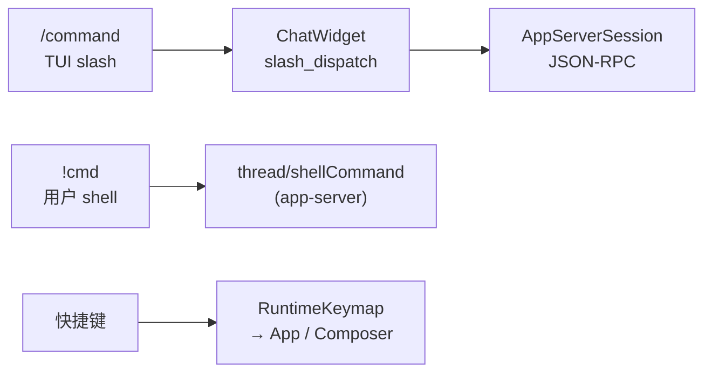

# TUI 指令参考 — slash、shell、快捷键

[English](tui-commands.md) | **中文**

Codex 终端 UI 里用户能用的「指令」：聊天里的 **`/slash`**、**`!` shell**、**快捷键**。接口分层见 [tui-interface-design_cn.md](tui-interface-design_cn.md)。

> **官方文档（优先对照）：** [CLI Slash commands](https://developers.openai.com/codex/cli/slash-commands) · [CLI 命令行参数](https://developers.openai.com/codex/cli/reference) · [CLI Features](https://developers.openai.com/codex/cli/features)  
> **源码枚举：** [`codex-rs/tui/src/slash_command.rs`](https://github.com/openai/codex/blob/main/codex-rs/tui/src/slash_command.rs)（弹窗顺序与 feature 门控以此为准）  
> **后端 RPC：** 多数 slash 最终调用 [app-server](https://developers.openai.com/codex/app-server) 方法（如 `turn/start`、`thread/compact/start`）

在 TUI 输入 **`/`** 可看当前环境过滤后的补全列表。

---

## 三类输入

| 类型 | 形式 | 说明 |
| ---- | ---- | ---- |
| Slash | `/model`、`/status`… | TUI 内置；见下表 |
| Shell | `!git status` | 用户 shell，非 agent turn；见 [thread/shellCommand](https://github.com/openai/codex/blob/main/codex-rs/app-server/README.md#api-overview) |
| 快捷键 | `Ctrl+T`、`Esc`… | 默认见 `keymap.rs`；`/keymap` 或 `tui.keymap` 可改 |

---

## 内置 slash 命令（源码枚举）

下列命令名来自 `SlashCommand`；**别名**单独列出。部分命令受 feature / 平台 / 场景隐藏。

### 会话与线程

| 命令 | 说明 | 别名 / 备注 |
| ---- | ---- | ----------- |
| `/new` | 对话中开新聊天 | task 中不可用 |
| `/resume` | 恢复会话 | 支持参数 |
| `/fork` | fork 当前会话 | task 中不可用 |
| `/rename` | 重命名 thread | 支持参数 |
| `/archive` | 归档并退出 | task 中不可用 |
| `/delete` | 永久删除并退出 | task 中不可用 |
| `/clear` | 清屏并开新聊天 | task 中不可用 |
| `/quit` `/exit` | 退出 | |
| `/app` | 在 Codex Desktop 继续 | 仅 macOS / Windows |

### 模型与模式

| 命令 | 说明 |
| ---- | ---- |
| `/model` | 选模型与 reasoning effort |
| `/plan` | Plan 模式 | 需 collaboration modes |
| `/goal` | 长跑任务 goal | `/goooal` 等变体可识别 |
| `/personality` | 沟通风格 | 需 feature |
| `/permissions` | 权限策略 | 见 [Permissions](https://developers.openai.com/codex/permissions) |
| `/approve` | 重试 auto-review 拒绝 | 命令名是 `approve` |

`/model` 下可能动态出现 **service tier** 子命令（如 fast），取决于账号与 feature。

### Agent / 多线程

| 命令 | 说明 |
| ---- | ---- |
| `/agent` | 切换活跃 agent thread |
| `/subagents` | 同上 |
| `/side` `/btw` | side 对话（临时 fork） | 支持参数 |

### 上下文与工具

| 命令 | 说明 |
| ---- | ---- |
| `/compact` | 压缩对话 | → `thread/compact/start` |
| `/review` | 审查改动 | 支持参数 |
| `/diff` | git diff | |
| `/mention` | @ 文件 | |
| `/skills` | skills | [Skills 文档](https://developers.openai.com/codex/skills) |
| `/mcp` | MCP 工具列表 | `/mcp verbose` |
| `/hooks` | lifecycle hooks | [Hooks](https://developers.openai.com/codex/hooks) |
| `/import` | 从 Claude Code 导入 | |
| `/init` | 生成 `AGENTS.md` | [AGENTS.md 指南](https://developers.openai.com/codex/guides/agents-md) |
| `/ide` | IDE 上下文 | 支持参数 |

### 状态与调试

| 命令 | 说明 |
| ---- | ---- |
| `/status` | 会话配置与 token | |
| `/usage` | 用量 / reset | 需 ChatGPT 登录 |
| `/debug-config` | config 层调试 | |
| `/rollout` | rollout 路径 | 仅 debug 构建 |
| `/test-approval` | 测试审批 UI | 仅 debug 构建 |

### UI 定制

| 命令 | 说明 |
| ---- | ---- |
| `/keymap` | 改快捷键 | [Config reference](https://developers.openai.com/codex/config-reference) |
| `/vim` | Vim 模式 | |
| `/theme` | 高亮主题 | |
| `/title` | 终端标题项 | |
| `/statusline` | 状态行项 | |
| `/pets` | 终端宠物 | 别名 `/pet` |
| `/raw` | raw scrollback | `on`/`off` |
| `/copy` | 复制上轮回复 | Android 隐藏 |

### 沙箱与实验

| 命令 | 说明 |
| ---- | ---- |
| `/setup-default-sandbox` | elevated sandbox | |
| `/sandbox-add-read-dir` | 沙箱可读目录 | 仅 Windows |
| `/experimental` | 实验 feature | |
| `/memories` | memory 配置 | [Memories](https://developers.openai.com/codex/memories) |

### 集成与其它

| 命令 | 说明 |
| ---- | ---- |
| `/apps` | connectors | 需 feature |
| `/plugins` | 插件 | 需 feature |
| `/logout` | 登出 | [Auth](https://developers.openai.com/codex/auth) |
| `/feedback` | 反馈日志 | |
| `/ps` | 后台终端列表 | |
| `/stop` | 停后台终端 | 别名 `/clean` |

---

## 可见性与场景限制

| 条件 | 影响 |
| ---- | ---- |
| collaboration modes 关 | 无 `/plan` |
| connectors 关 | 无 `/apps` |
| plugins 关 | 无 `/plugins` |
| **side 对话** | 多数 slash 不可用；保留 `/copy`、`/raw`、`/diff`、`/status`、`/usage`、`/ide` 等 |
| **task 运行中** | `/new`、`/compact`、`/theme` 等不可用；`/status`、`/goal` 等仍可用 |
| task 运行中排队 | 输入 slash 后 **`Tab`** 可排队到下一轮 |

---

## 默认快捷键

可用 **`/keymap`** 查看并写入 `config.toml` 的 `tui.keymap`。默认值在 [`keymap.rs` `built_in_defaults`](https://github.com/openai/codex/blob/main/codex-rs/tui/src/keymap.rs)。

| 按键 | 作用 |
| ---- | ---- |
| `Enter` | 提交 |
| `Tab` | 运行时排队；空闲时提交 |
| `Ctrl+R` | 反向历史搜索 |
| `Esc` | 中断 turn |
| `Ctrl+C` | 中断 / 关弹窗 / 双击退出 |
| `Ctrl+D` | 退出（双按） |
| `Ctrl+T` | transcript overlay |
| `Ctrl+O` | 复制上轮 agent 回复 |
| `Ctrl+L` | 清屏 |
| `Ctrl+G` | 外部编辑器 |
| `Alt+R` | 切换 raw scrollback |
| `Alt+,` / `Alt+.` | 降低 / 提高 reasoning effort |
| `?` | 快捷键 overlay |

---

## CLI 子命令（终端里 `codex …`，非聊天 slash）

| 子命令 | 说明 | 文档 |
| ------ | ---- | ---- |
| （无子命令） | 进 TUI | [CLI Features](https://developers.openai.com/codex/cli/features) |
| `exec` | 无头模式 | [Non-interactive](https://developers.openai.com/codex/noninteractive) |
| `app-server` | JSON-RPC 服务 | [App Server](https://developers.openai.com/codex/app-server) |
| `resume` / `fork` | 恢复 / 分支 | [CLI reference](https://developers.openai.com/codex/cli/reference) |
| `archive` / `delete` / `unarchive` | 会话管理 | 同上 |

---

## 相关笔记

| 文档 | 链接 |
| ---- | ---- |
| TUI 接口设计 | [tui-interface-design_cn.md](tui-interface-design_cn.md) |
| 架构总览 | [architecture_cn.md](architecture_cn.md) |