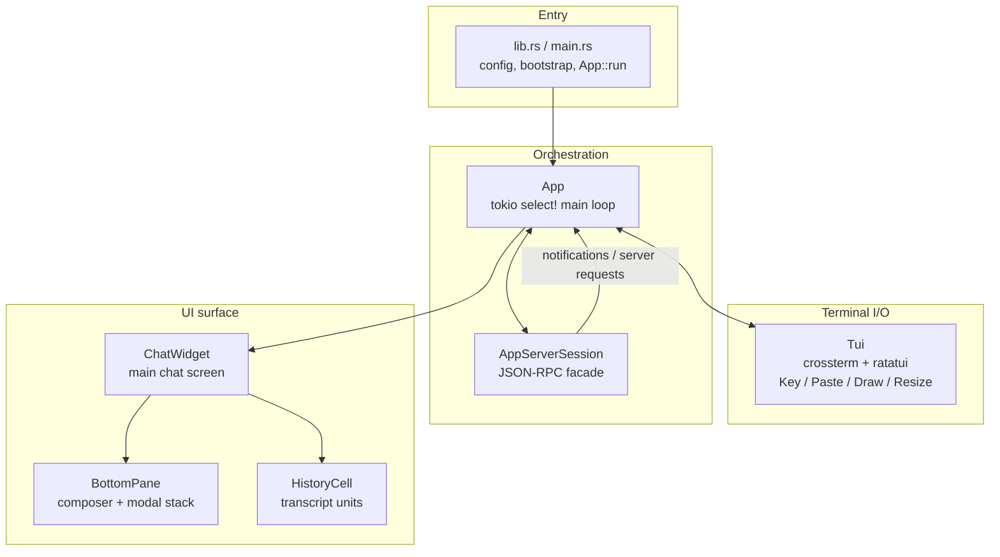
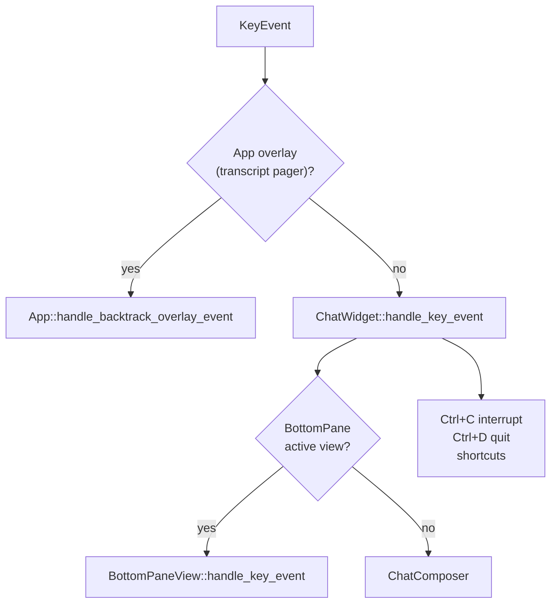
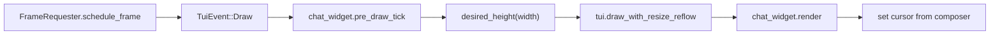

# TUI interface design — `codex-tui`

**English** | [中文](tui-interface-design_cn.md)

How the [`codex-tui`](https://github.com/openai/codex/tree/main/codex-rs/tui) crate is structured: layers, event buses, rendering traits, and input routing. Read against the repo map in [architecture.md](architecture.md) and crate layering in [layeredDesign.md](layeredDesign.md).

> Source tree: [`codex-rs/tui/src/`](https://github.com/openai/codex/tree/main/codex-rs/tui/src)

---

## One-line summary

**Event-driven UI** over **ratatui + crossterm**, talking to the agent through **`app-server` JSON-RPC** (not by embedding `codex-core` session logic in widgets). Three parallel inputs converge in `App`; visible output is built from **`Renderable`** + **`HistoryCell`**; transient footer UI uses **`BottomPaneView`**.

---

## Layer stack



| Layer | Primary modules | Responsibility |
| ----- | --------------- | -------------- |
| Entry | `lib.rs`, `cli.rs` | Load config, connect app-server, construct `App`, enter run loop |
| Terminal | `tui.rs`, `custom_terminal.rs` | Raw mode, event stream, frame scheduling, alt-screen overlays |
| Orchestration | `app.rs`, `app/*` | Global state, four-way `select!`, dispatch `AppEvent` |
| Session facade | `app_server_session.rs` | Typed `thread/*`, `turn/*`, config RPC — keeps JSON-RPC out of widgets |
| Chat surface | `chatwidget.rs`, `chatwidget/*` | Protocol stream → UI state; keys → user intent |
| Footer | `bottom_pane/` | `ChatComposer`, footer, approval/popup stack |
| Transcript | `history_cell/` | One committed (or in-flight) block of conversation UI |

---

## Main event loop

`App::run` (`app.rs`) runs a `tokio::select!` over **four sources**:

| Source | Type | Typical payloads |
| ------ | ---- | ---------------- |
| Internal bus | `AppEvent` | Open picker, write config, insert history cell, `Exit` |
| Terminal | `TuiEvent` | `Key`, `Paste`, `Draw`, `Resize` |
| App-server stream | `AppServerEvent` | `ServerNotification`, `ServerRequest`, disconnect |
| Active sub-thread | per-thread channel | Multi-agent / collab thread events |

Design intent: **widgets never hold a mutable `App` reference**. They clone `AppEventSender` and post events upward; `App` alone mutates session-wide state and calls `AppServerSession`.

---

## `TuiEvent` — terminal side

Defined in `tui.rs`:

| Variant | Role |
| ------- | ---- |
| `Key(KeyEvent)` | Keyboard after focus/paste bookkeeping |
| `Paste(String)` | Bracketed paste normalized before the composer |
| `Draw` | Scheduled repaint (rate-limited via `FrameRequester`) |
| `Resize` | Terminal size change; may trigger transcript reflow |

On `Draw` / `Resize`, `App::handle_tui_event` runs `pre_draw_tick`, measures `ChatWidget::desired_height`, then `draw_with_resize_reflow` → `ChatWidget::render`.

---

## `AppEvent` vs `AppCommand`

| Channel | Enum | Meaning |
| ------- | ---- | ------- |
| UI coordination | `AppEvent` (`app_event.rs`) | "App layer, please do X" — pickers, config, navigation, shutdown mode |
| Agent operations | `AppCommand` (`app_command.rs`) | "Send this to the session" — `UserTurn`, `Interrupt`, approvals, `Compact`, rollback |

`AppEventSender` (`app_event_sender.rs`) wraps the channel and can submit typed `AppCommand`s without duplicating construction at every callsite.

**Rule of thumb:** if it only changes local UI state → often handled inside `ChatWidget` / `BottomPane`; if it needs RPC, config persistence, or a new thread → `AppEvent` → `App::handle_event` → `AppServerSession`.

---

## `AppServerEvent` — backend push

Handled in `app/app_server_events.rs`:

| Kind | UI effect |
| ---- | --------- |
| `ServerNotification` | Turn progress, MCP status, rate limits → `ChatWidget` updates cells / status |
| `ServerRequest` | Exec/patch/MCP elicitation → push `BottomPaneView` approval overlay |
| `Disconnected` | Error cell + `FatalExitRequest` |

TUI default path uses an **in-process** app-server (`AppServerClient`), so semantics match IDE/SDK clients without a separate process.

---

## Rendering: `Renderable`

`render/renderable.rs` defines the layout contract used across the crate:

```rust
pub trait Renderable {
    fn render(&self, area: Rect, buf: &mut Buffer);
    fn desired_height(&self, width: u16) -> u16;
    fn cursor_pos(&self, area: Rect) -> Option<(u16, u16)>;
    fn cursor_style(&self, area: Rect) -> SetCursorStyle;
}
```

- **Measure then draw:** `App::render_chat_widget_frame` asks height first, then paints.
- **`FlexRenderable`:** vertical flex stack for the main chat column (`chatwidget/rendering.rs`).
- **`RenderableItem`:** owned or borrowed trait object for composition.

Implementors include `ChatWidget`, `BottomPane`, history cells, and every `BottomPaneView`.

---

## Transcript: `HistoryCell`

`history_cell/mod.rs` — one display unit in the conversation:

| Method | Purpose |
| ------ | ------- |
| `display_lines(width)` | Main inline viewport |
| `transcript_lines(width)` | Full transcript overlay (`Ctrl+T`); may differ (e.g. exec shows `$` prefix) |
| `desired_height(width)` | Row count after ratatui wrap (URLs can wrap wider than logical line count) |

**Two buffers:**

| Buffer | Owner | Lifecycle |
| ------ | ----- | --------- |
| Committed cells | `App.transcript_cells: Vec<Arc<dyn HistoryCell>>` | Finalized after streaming / tool groups settle |
| Active cell | `ChatWidget.transcript.active_cell` | Mutates in place while streaming; overlay shows a cached live tail |

Module docs in `chatwidget.rs` describe how `active_cell_transcript_key()` keeps the overlay tail in sync without rebuilding every frame.

---

## Footer: `BottomPane` + `BottomPaneView`

`bottom_pane/mod.rs` owns:

1. **`ChatComposer`** (`chat_composer.rs`) — input state machine: slash commands, `@` / `$` mentions, file search, ↑↓ history, `Ctrl+R` reverse search.
2. **View stack** — transient modals that **replace** the composer (pickers, approvals, MCP forms).

`BottomPaneView` (`bottom_pane_view.rs`) extends `Renderable` with:

- `handle_key_event`, `is_complete`, `completion()`
- `on_ctrl_c` — local dismiss vs bubble up
- optional `handle_paste`, `will_interrupt_turn_on_key_event`

**Slash commands:** parsing/staging lives in the composer; **acceptance and history recording** live in `ChatWidget` so recall and dispatch stay two-phase.

---

## `ChatWidget` — main UI facade

`ChatWidget` (`chatwidget.rs` + submodules) holds per-session UI state:

| Owns | Role |
| ---- | ---- |
| `bottom_pane` | Input + overlays |
| `transcript` | Active cell, scroll, streaming buffers |
| `stream_controller` | Chunked markdown commit while streaming |
| `turn_lifecycle` | Agent-turn / MCP-startup busy → footer spinner |
| `app_event_tx` | Post `AppEvent` to `App` |
| `codex_op_target` | Submit `AppCommand` |

It does **not** run the agent loop; it reflects `app-server` notifications and turns user actions into RPC.

**Layout** (`chatwidget/rendering.rs`): flex column = active transcript area + optional hook/status rows + `BottomPane` (with optional right reserve for ambient pet image).

---

## `AppServerSession` — RPC anti-corruption layer

`app_server_session.rs` documents its role explicitly: typed JSON-RPC for the TUI, keeping request plumbing out of `App` and `ChatWidget`.

Exposes helpers such as `thread/start`, `thread/resume`, `turn/start`, `turn/interrupt`, config batch write, skills list, etc.

`ThreadParamsMode`:

| Mode | When |
| ---- | ---- |
| `Embedded` | Default in-process app-server |
| `Remote` | TUI connected to external app-server (IDE-style) |

---

## Input routing (who gets the key?)



Layered responsibility (from module docs):

- **BottomPane:** which local surface gets the key (view vs composer).
- **ChatWidget:** process-level interrupt, double-press quit, copy-last-response, etc.
- **App:** agent switching, global pickers, session lifecycle.

---

## Draw pipeline (one frame)



---

## Module organization habits

| Pattern | Example |
| ------- | ------- |
| Thin orchestrator file | `app.rs`, `chatwidget.rs` — delegate to `app/*`, `chatwidget/*` |
| Snapshot tests for visible UI | `chatwidget/tests/`, `history_cell/snapshots/` (`insta`) |
| Small public API | Most types are `pub(crate)`; `lib.rs` exports run/session helpers |
| Protocol types at boundaries | `codex-app-server-protocol` types flow through events and cells |

---

## Public crate API (`codex_tui` boundary)

The TUI does **not** define the agent protocol. It exports a narrow surface for `codex-cli`, `codex-cloud-tasks`, etc. See [`lib.rs` re-exports](https://github.com/openai/codex/blob/main/codex-rs/tui/src/lib.rs).

| Category | Types / functions | Role |
| -------- | ----------------- | ---- |
| Launch | `run_main` → `AppExitInfo` | Full TUI session |
| CLI | `Cli` | clap flags |
| Exit | `AppExitInfo`, `ExitReason`, `TokenUsage` | Shutdown summary |
| Remote | `resolve_remote_addr`, `remote_addr_supports_auth_token`, `RemoteAppServerEndpoint` | External app-server |
| Archive | `run_session_archive_command`, `SessionArchiveAction`, … | `archive` / `delete` / `unarchive` |
| Update | `UpdateAction`, `get_update_action` | Self-update |
| Errors | `LocalStateDbStartupError` | State DB startup failure |
| Reusable widget | `ComposerInput`, `ComposerAction` | Extracted composer (`cloud-tasks`) |
| Render helpers | `render_markdown_text`, `Terminal`, `insert_history_lines`, `RowBuilder` | Markdown / scrollback / wrap |

**Not exported:** `App`, `ChatWidget`, `AppEvent`, `Renderable`, `HistoryCell`.

---

## Internal architecture API (`pub(crate)`)

| API | Role |
| --- | ---- |
| `AppEvent` | UI → `App` coordination |
| `AppCommand` | UI → agent (`UserTurn`, `Interrupt`, approvals, …) |
| `TuiEvent` | Terminal → `App` |
| `AppServerEvent` | app-server push → `App` |
| `Renderable` | Measure + paint + cursor |
| `HistoryCell` | Transcript cell |
| `BottomPaneView` | Footer modal interaction |
| `ChatWidget` | Main chat facade |
| `AppServerSession` | JSON-RPC facade |

---

## Mapping to official API docs

Runtime chat goes through **app-server JSON-RPC**. Slash commands and shortcuts are **local TUI UI**, often translated into app-server methods.

| Topic | Official docs | Repo / lab notes |
| ----- | ------------- | -------------- |
| **App Server JSON-RPC** | [Codex App Server](https://developers.openai.com/codex/app-server) · detailed [app-server README](https://github.com/openai/codex/blob/main/codex-rs/app-server/README.md) | `app_server_session.rs` · [architecture.md](architecture.md) |
| Schema / TS generation | `codex app-server generate-json-schema` / `generate-ts` | `codex-app-server-protocol` |
| **CLI slash commands** | [CLI Slash commands](https://developers.openai.com/codex/cli/slash-commands) | [tui-commands.md](tui-commands.md) · `slash_command.rs` |
| CLI flags & subcommands | [Command line reference](https://developers.openai.com/codex/cli/reference) | `codex-rs/cli` |
| Interactive features | [CLI Features](https://developers.openai.com/codex/cli/features) | — |
| Keymap (`tui.keymap`) | [Config reference](https://developers.openai.com/codex/config-reference) | `keymap.rs` · `/keymap` |
| `!` shell lines | app-server `thread/shellCommand` | composer `!` prefix |
| Permissions / sandbox | [Permissions](https://developers.openai.com/codex/permissions) · [Agent approvals & security](https://developers.openai.com/codex/agent-approvals-security) | `/permissions` |
| Codex hub | [developers.openai.com/codex](https://developers.openai.com/codex) | — |

---

## Related docs

| Doc | Link |
| --- | ---- |
| TUI commands (slash / shortcuts) | [tui-commands.md](tui-commands.md) |
| Architecture map | [architecture.md](architecture.md) |
| Crate layering | [layeredDesign.md](layeredDesign.md) |
| App-server RPC (repo detail) | [app-server README](https://github.com/openai/codex/blob/main/codex-rs/app-server/README.md) |
| TUI styling | [`codex-rs/tui/styles.md`](https://github.com/openai/codex/blob/main/codex-rs/tui/styles.md) |