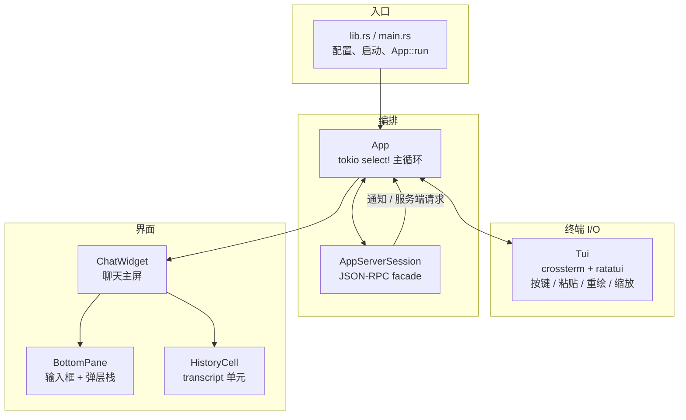
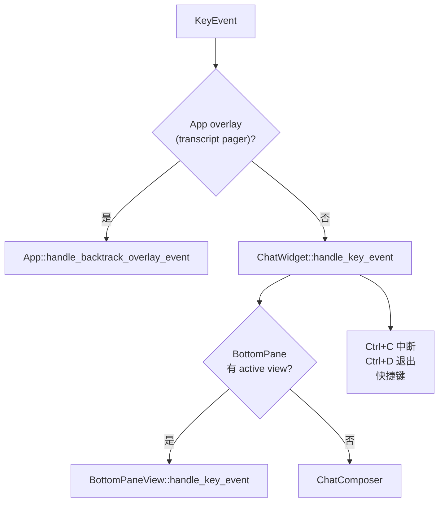
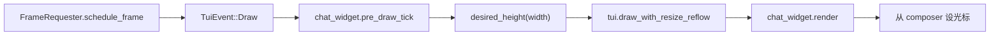

# TUI 接口设计 — `codex-tui`

[English](tui-interface-design.md) | **中文**

[`codex-tui`](https://github.com/openai/codex/tree/main/codex-rs/tui) crate 的结构说明：分层、事件总线、渲染 trait、输入路由。配合 [architecture_cn.md](architecture_cn.md) 的仓库地图和 [layeredDesign_cn.md](layeredDesign_cn.md) 的分层阅读。

> 源码目录：[`codex-rs/tui/src/`](https://github.com/openai/codex/tree/main/codex-rs/tui/src)

---

## 一句话

**事件驱动 UI**，底层 **ratatui + crossterm**，通过 **`app-server` JSON-RPC** 和 agent 通信（不在 widget 里嵌入 `codex-core` 会话逻辑）。三路输入在 `App` 汇合；可见内容靠 **`Renderable`** + **`HistoryCell`** 拼出来；底部临时 UI 用 **`BottomPaneView`**。

---

## 分层结构



| 层 | 主要模块 | 职责 |
| -- | -------- | ---- |
| 入口 | `lib.rs`、`cli.rs` | 读配置、连 app-server、构造 `App`、进入 run loop |
| 终端 | `tui.rs`、`custom_terminal.rs` | raw mode、事件流、帧调度、alt-screen overlay |
| 编排 | `app.rs`、`app/*` | 全局状态、四路 `select!`、分发 `AppEvent` |
| 会话 facade | `app_server_session.rs` | 类型化的 `thread/*`、`turn/*`、配置 RPC — 把 JSON-RPC 挡在 widget 外 |
| 聊天界面 | `chatwidget.rs`、`chatwidget/*` | 协议流 → UI 状态；按键 → 用户意图 |
| 底部 | `bottom_pane/` | `ChatComposer`、footer、审批/弹窗栈 |
| 内容 | `history_cell/` | 一段已提交（或在途）的对话 UI |

---

## 主事件循环

`App::run`（`app.rs`）用 `tokio::select!` 同时监听 **四路输入**：

| 来源 | 类型 | 典型内容 |
| ---- | ---- | -------- |
| 内部总线 | `AppEvent` | 开 picker、写配置、插入 history cell、`Exit` |
| 终端 | `TuiEvent` | `Key`、`Paste`、`Draw`、`Resize` |
| app-server 流 | `AppServerEvent` | `ServerNotification`、`ServerRequest`、断连 |
| 活跃子线程 | 每线程 channel | 多 agent / collab 线程事件 |

设计意图：**widget 不持有可变的 `App` 引用**。它们 clone `AppEventSender` 往上发事件；只有 `App` 改会话级状态并调用 `AppServerSession`。

---

## `TuiEvent` — 终端侧

定义在 `tui.rs`：

| 变体 | 作用 |
| ---- | ---- |
| `Key(KeyEvent)` | 键盘（焦点/粘贴预处理之后） |
| `Paste(String)` | 括号粘贴，进 composer 前归一化 |
| `Draw` | 调度重绘（`FrameRequester` 限帧） |
| `Resize` | 终端尺寸变化；可能触发 transcript reflow |

`Draw` / `Resize` 时，`App::handle_tui_event` 会 `pre_draw_tick`、量 `ChatWidget::desired_height`，再 `draw_with_resize_reflow` → `ChatWidget::render`。

---

## `AppEvent` 与 `AppCommand`

| 通道 | 枚举 | 含义 |
| ---- | ---- | ---- |
| UI 协调 | `AppEvent`（`app_event.rs`） | 「App 层请做 X」— picker、配置、导航、退出模式 |
| Agent 操作 | `AppCommand`（`app_command.rs`） | 「发给会话」— `UserTurn`、`Interrupt`、审批、`Compact`、rollback |

`AppEventSender`（`app_event_sender.rs`）包装 channel，可在各 callsite 提交类型化的 `AppCommand`，避免重复拼装。

**经验法则：** 只改本地 UI → 常在 `ChatWidget` / `BottomPane` 内消化；需要 RPC、持久化配置或新 thread → `AppEvent` → `App::handle_event` → `AppServerSession`。

---

## `AppServerEvent` — 后端推送

在 `app/app_server_events.rs` 处理：

| 种类 | UI 效果 |
| ---- | ------- |
| `ServerNotification` | turn 进度、MCP 状态、rate limit → `ChatWidget` 更新 cell / 状态行 |
| `ServerRequest` | exec/patch/MCP elicitation → 压入 `BottomPaneView` 审批 overlay |
| `Disconnected` | 错误 cell + `FatalExitRequest` |

TUI 默认走 **进程内** app-server（`AppServerClient`），语义与 IDE/SDK 一致，无需单独进程。

---

## 渲染：`Renderable`

`render/renderable.rs` 定义全 crate 共用的布局契约：

```rust
pub trait Renderable {
    fn render(&self, area: Rect, buf: &mut Buffer);
    fn desired_height(&self, width: u16) -> u16;
    fn cursor_pos(&self, area: Rect) -> Option<(u16, u16)>;
    fn cursor_style(&self, area: Rect) -> SetCursorStyle;
}
```

- **先量后画：** `App::render_chat_widget_frame` 先算高度再绘制。
- **`FlexRenderable`：** 主聊天列纵向 flex（`chatwidget/rendering.rs`）。
- **`RenderableItem`：** owned / borrowed trait object 组合。

`ChatWidget`、`BottomPane`、各类 cell、每个 `BottomPaneView` 都实现该 trait。

---

## 内容：`HistoryCell`

`history_cell/mod.rs` — 对话里的一块显示单元：

| 方法 | 用途 |
| ---- | ---- |
| `display_lines(width)` | 主 inline 视口 |
| `transcript_lines(width)` | 全量 transcript overlay（`Ctrl+T`）；可与主视口不同（如 exec 带 `$` 前缀） |
| `desired_height(width)` | ratatui 换行后的真实行数（URL 可能比逻辑行更宽） |

**两套缓冲：**

| 缓冲 | 归属 | 生命周期 |
| ---- | ---- | -------- |
| 已提交 cells | `App.transcript_cells: Vec<Arc<dyn HistoryCell>>` | 流式/工具组结束后定型 |
| 在途 active cell | `ChatWidget.transcript.active_cell` | 流式中可原地变；overlay 用缓存 live tail |

`chatwidget.rs` 模块注释说明 `active_cell_transcript_key()` 如何在不必每帧重建的前提下同步 overlay 尾部。

---

## 底部：`BottomPane` + `BottomPaneView`

`bottom_pane/mod.rs` 拥有：

1. **`ChatComposer`**（`chat_composer.rs`）— 输入状态机：slash、`@` / `$` mention、文件搜索、↑↓ 历史、`Ctrl+R` 反向搜索。
2. **View 栈** — 临时 modal **替换** composer（picker、审批、MCP 表单）。

`BottomPaneView`（`bottom_pane_view.rs`）在 `Renderable` 之上增加：

- `handle_key_event`、`is_complete`、`completion()`
- `on_ctrl_c` — 本地关闭 vs 往上冒泡
- 可选 `handle_paste`、`will_interrupt_turn_on_key_event`

**Slash 命令：** 解析/暂存在 composer；**接受与记入历史**在 `ChatWidget`，recall 与 dispatch 分两阶段。

---

## `ChatWidget` — 主 UI 门面

`ChatWidget`（`chatwidget.rs` + 子模块）持有单会话 UI 状态：

| 字段方向 | 作用 |
| -------- | ---- |
| `bottom_pane` | 输入 + overlay |
| `transcript` | active cell、滚动、流式缓冲 |
| `stream_controller` | 流式 markdown 分块提交 |
| `turn_lifecycle` | agent turn / MCP 启动 busy → footer 转圈 |
| `app_event_tx` | 向 `App` 发 `AppEvent` |
| `codex_op_target` | 提交 `AppCommand` |

**不跑** agent 主循环；只消费 app-server 通知，把用户操作变成 RPC。

**布局**（`chatwidget/rendering.rs`）：flex 列 = active 区 + 可选 hook/状态行 + `BottomPane`（可为 ambient pet 图留右侧 reserve）。

---

## `AppServerSession` — RPC 防腐层

`app_server_session.rs` 写明职责：为 TUI 封装类型化 JSON-RPC，把 request plumbing 挡在 `App` / `ChatWidget` 外。

提供 `thread/start`、`thread/resume`、`turn/start`、`turn/interrupt`、配置批量写、skills list 等。

`ThreadParamsMode`：

| 模式 | 场景 |
| ---- | ---- |
| `Embedded` | 默认进程内 app-server |
| `Remote` | TUI 连外部 app-server（IDE 式） |

---

## 输入路由（键给谁？）



分层职责（见各模块头注释）：

- **BottomPane：** 本地表面谁先吃键（view vs composer）。
- **ChatWidget：** 进程级中断、双击退出、复制上轮回复等。
- **App：** 切 agent、全局 picker、会话生命周期。

---

## 绘制管线（一帧）



---

## 模块组织习惯

| 模式 | 例子 |
| ---- | ---- |
| 薄编排文件 | `app.rs`、`chatwidget.rs` — 逻辑下沉到 `app/*`、`chatwidget/*` |
| 可见 UI 用 snapshot 测 | `chatwidget/tests/`、`history_cell/snapshots/`（`insta`） |
| 对外 API 很小 | 多数 `pub(crate)`；`lib.rs` 导出 run / session 相关 |
| 边界用协议类型 | `codex-app-server-protocol` 贯穿 event 与 cell |

---

## 对外 public API（`codex_tui` crate 边界）

TUI **不定义** agent 协议；对外只暴露窄接口，供 `codex-cli`、`codex-cloud-tasks` 等复用。定义见 [`slash_command.rs` 之外的 `lib.rs` 重导出](https://github.com/openai/codex/blob/main/codex-rs/tui/src/lib.rs)。

| 类别 | 类型 / 函数 | 用途 |
| ---- | ----------- | ---- |
| 启动 | `run_main` → `AppExitInfo` | 整次 TUI 会话 |
| CLI | `Cli` | clap 参数 |
| 退出 | `AppExitInfo`、`ExitReason`、`TokenUsage` | 退出摘要 |
| 远程 | `resolve_remote_addr`、`remote_addr_supports_auth_token`、`RemoteAppServerEndpoint` | 连外部 app-server |
| 归档 | `run_session_archive_command`、`SessionArchiveAction`… | `archive` / `delete` / `unarchive` |
| 更新 | `UpdateAction`、`get_update_action` | 自更新 |
| 错误 | `LocalStateDbStartupError` | state DB 启动失败 |
| 复用组件 | `ComposerInput`、`ComposerAction` | 抽出输入框（cloud-tasks） |
| 渲染工具 | `render_markdown_text`、`Terminal`、`insert_history_lines`、`RowBuilder` | markdown / scrollback / 换行 |

**没有**对外暴露：`App`、`ChatWidget`、`AppEvent`、`Renderable`、`HistoryCell`。

---

## 内部架构 API（`pub(crate)`）

| API | 作用 |
| --- | ---- |
| `AppEvent` | UI → `App` 协调（picker、配置、退出模式…） |
| `AppCommand` | UI → agent（`UserTurn`、`Interrupt`、审批…） |
| `TuiEvent` | 终端 → `App`（`Key` / `Paste` / `Draw` / `Resize`） |
| `AppServerEvent` | app-server 推送 → `App` |
| `Renderable` | 测量 + 绘制 + 光标 |
| `HistoryCell` | transcript 单元 |
| `BottomPaneView` | 底部弹层交互 |
| `ChatWidget` | 聊天主屏门面 |
| `AppServerSession` | JSON-RPC facade |

---

## 与官方 API 文档的对应关系

TUI 运行时对话走 **app-server JSON-RPC**；slash / 快捷键是 **TUI 本地 UI**，多数再转成 app-server 方法。

| 你想查的 | 官方文档 | 仓库内源码 / 笔记 |
| -------- | -------- | ----------------- |
| **App Server JSON-RPC**（thread/turn、审批、事件流） | [Codex App Server](https://developers.openai.com/codex/app-server) · 详尽版 [app-server README](https://github.com/openai/codex/blob/main/codex-rs/app-server/README.md) | `app_server_session.rs` · [architecture_cn.md](architecture_cn.md) |
| 生成 schema / TS 类型 | `codex app-server generate-json-schema` / `generate-ts`（见 app-server README） | `codex-app-server-protocol` |
| **CLI slash 命令**（用户可见列表） | [CLI Slash commands](https://developers.openai.com/codex/cli/slash-commands) | [tui-commands_cn.md](tui-commands_cn.md) · `slash_command.rs` |
| CLI 参数与子命令 | [Command line reference](https://developers.openai.com/codex/cli/reference) | `codex-rs/cli` |
| 交互模式 / 功能概览 | [CLI Features](https://developers.openai.com/codex/cli/features) | — |
| 快捷键（`tui.keymap`） | 配置见 [Config reference](https://developers.openai.com/codex/config-reference) | `keymap.rs` · `/keymap` |
| `!` shell 命令 | app-server：`thread/shellCommand`（[API Overview](https://github.com/openai/codex/blob/main/codex-rs/app-server/README.md#api-overview)） | composer `!` 前缀 |
| 权限 / 沙箱 | [Permissions](https://developers.openai.com/codex/permissions) · [Agent approvals & security](https://developers.openai.com/codex/agent-approvals-security) | `/permissions` |
| Codex 总入口 | [developers.openai.com/codex](https://developers.openai.com/codex) | — |

---

## 相关文档

| 文档 | 链接 |
| ---- | ---- |
| TUI 指令（slash / 快捷键） | [tui-commands_cn.md](tui-commands_cn.md) |
| 架构地图 | [architecture_cn.md](architecture_cn.md) |
| 分层详解 | [layeredDesign_cn.md](layeredDesign_cn.md) |
| app-server RPC（仓库详尽版） | [app-server README](https://github.com/openai/codex/blob/main/codex-rs/app-server/README.md) |
| TUI 样式 | [`codex-rs/tui/styles.md`](https://github.com/openai/codex/blob/main/codex-rs/tui/styles.md) |